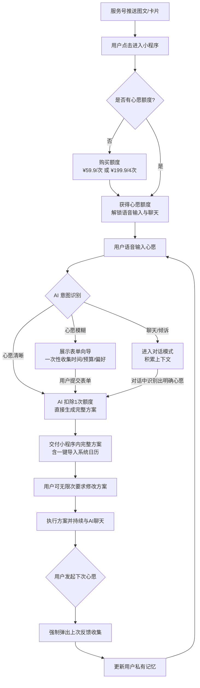
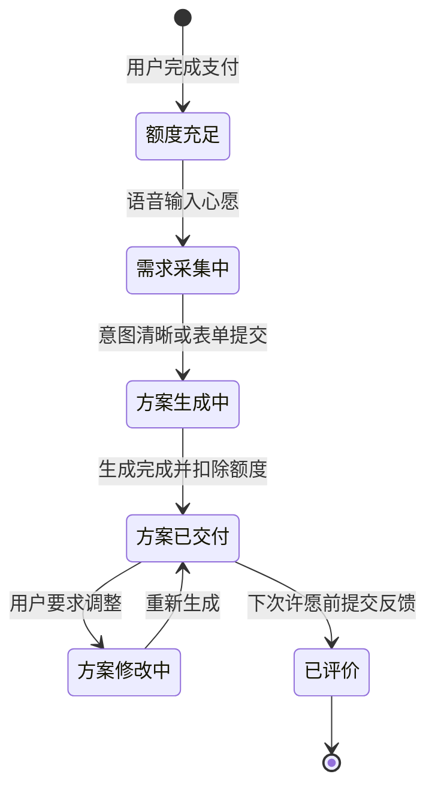

# 产品需求文档：Wishpool Buddy - V1.0

## 1. 综述 (Overview)
### 1.1 项目背景与核心问题
当前一二线城市白领和情侣在面临周末出行或职场关键节点时，常常存在“有想法但懒得做功课”的“决策瘫痪”痛点。传统的泛陪伴AI或内容种草平台（如小红书）只能提供信息，无法提供“执行力”。

Wishpool Buddy 的核心定位是**“心愿执行服务”**。它不单纯卖内容或泛陪伴，而是帮助用户把一个模糊的小心愿推进成可执行的结果。产品采用“服务号+小程序”的轻运营架构，通过单次付费（¥59.9/次或¥199.9/4次）为用户提供确定性的路书或职场方案，并在付费后提供持续的聊天权益以积累用户的私有上下文（Private Context）。

### 1.2 核心业务流程 / 用户旅程地图
1. **阶段一：发现与触达** - 通过服务号图文推送激发用户在周末或职场场景下的心愿。
2. **阶段二：付费与意图识别** - 用户在小程序内购买心愿额度后，通过语音输入心愿，AI 识别意图（聊天/清晰/模糊）。
3. **阶段三：追问与方案生成** - 对于模糊心愿，系统通过表单向导一次性追问；收集完整后，AI 立即生成 1 个完整的执行方案。
4. **阶段四：接收与执行** - 用户在小程序内接收方案（含日历邀请），并在执行过程中随时与 AI 聊天，积累上下文。
5. **阶段五：反馈与复购** - 在用户发起下一次心愿前，系统收集上一次的反馈，更新私有记忆。

### 1.3 Mermaid 图（流程/状态/时序）

#### 1.3.1 用户操作流


#### 1.3.2 方案生命周期状态机


---

## 2. 用户故事详述 (User Stories)

### 阶段一：发现与触达

---

#### **US-01: 服务号场景化推送**
* **价值陈述 (Value Statement)**:
  * **作为** 潜在用户或已关注用户
  * **我希望** 每周两次在微信服务号收到图文并茂的场景灵感（工作日职场，周末生活）
  * **以便于** 激发我的需求，并通过卡片按钮一键跳转到小程序许愿。
* **业务规则与逻辑 (Business Logic)**:
  1. **前置条件**: 用户已关注 Wishpool Buddy 微信服务号。
  2. **操作流程 (Happy Path)**:
     * 运营系统每周两次（如周二推职场，周四推周末）发送图文推送。
     * 用户点击推送，可以阅读全文灵感。
     * 文章底部或中间包含小程序跳转卡片（按钮文案如：“把这个灵感变成你的周末计划”）。
     * 用户点击卡片，直接唤起并跳转至微信小程序首页。
  3. **异常处理 (Error Handling)**:
     * 若用户未绑定微信登录，跳转小程序后需先完成静默授权登录。
* **验收标准 (Acceptance Criteria)**:
  * **场景1: 成功阅读并跳转**
    * **GIVEN** 用户在微信会话列表收到服务号推送
    * **WHEN** 用户点击文章内的卡片
    * **THEN** 成功打开小程序，且未付费用户看到付费引导，已付费用户看到语音输入按钮。

---

### 阶段二：付费与意图识别

---

#### **US-02: 购买心愿额度**
* **价值陈述 (Value Statement)**:
  * **作为** 新用户或额度耗尽的用户
  * **我希望** 能够明确看到服务的价值并一次性购买心愿额度
  * **以便于** 解锁许愿功能和持续的 AI 陪聊权益。
* **业务规则与逻辑 (Business Logic)**:
  1. **前置条件**: 用户当前心愿额度为 0。
  2. **操作流程 (Happy Path)**:
     * 小程序首页不展示语音输入框，而是展示价值主张和购买选项。
     * 提供两个 SKU：单次体验版（¥59.9，含1次方案+无限修改+聊天权益）和 四次超值版（¥199.9，含4次方案+无限修改+聊天权益，按需使用无有效期）。
     * 用户点击购买，唤起微信支付。
     * 支付成功后，首页状态切换，展示语音输入按钮，并提示“你当前有 X 次心愿额度”。
  3. **异常处理 (Error Handling)**:
     * 支付取消或失败：停留在购买页，提示“支付未完成”。
* **验收标准 (Acceptance Criteria)**:
  * **场景1: 成功购买额度**
    * **GIVEN** 用户额度为 0，停留在首页
    * **WHEN** 选择 ¥59.9 套餐并完成微信支付
    * **THEN** 首页变为“许愿态”，显示剩余额度为 1，并解锁语音输入功能。

---

#### **US-03: 语音输入与意图识别**
* **价值陈述 (Value Statement)**:
  * **作为** 已付费用户
  * **我希望** 能用最自然的语音方式表达我的想法（倾诉或许愿）
  * **以便于** AI 自动判断我是需要聊天，还是需要立刻生成方案，或者需要补充信息。
* **业务规则与逻辑 (Business Logic)**:
  1. **前置条件**: 用户心愿额度 > 0。
  2. **操作流程 (Happy Path)**:
     * 用户长按麦克风说话，松开后发送。
     * AI 解析语音内容并进行意图分类：
       * **分支 A（聊天/倾诉）**：不扣除额度，AI 以文字/语音回复，进入对话流，同时记录用户情绪和偏好作为 Context。
       * **分支 B（心愿清晰）**：直接触发方案生成流程（见 US-05），并扣除 1 次额度。
       * **分支 C（心愿模糊）**：触发表单向导（见 US-04）。
  3. **异常处理 (Error Handling)**:
     * 语音识别失败或过短：提示“没听清，请再试一次”。
* **验收标准 (Acceptance Criteria)**:
  * **场景1: 识别为聊天**
    * **GIVEN** 用户额度 > 0
    * **WHEN** 用户语音输入“今天工作好累啊”
    * **THEN** AI 给出安慰回复，不扣除额度。
  * **场景2: 识别为清晰心愿**
    * **GIVEN** 用户额度 > 0
    * **WHEN** 用户语音输入“帮我安排明天下午在徐汇滨江的看展路线，预算200”
    * **THEN** 额度-1，系统提示“正在为您生成专属方案...”。

---

### 阶段三：追问与方案生成

---

#### **US-04: 模糊心愿表单向导**
* **价值陈述 (Value Statement)**:
  * **作为** 表达了模糊心愿的用户
  * **我希望** 系统能一次性把需要补充的信息列出来让我填
  * **以便于** 我不用被来回追问，能快速拿到准确的方案。
* **业务规则与逻辑 (Business Logic)**:
  1. **前置条件**: AI 意图识别判断为“心愿模糊”。
  2. **操作流程 (Happy Path)**:
     * 小程序界面弹出一个结构化表单。
     * 表单字段根据心愿类型动态生成，通常包含：时间范围、预算范围、城市/场景、绝对不要什么（禁忌）。
     * 用户一次性填写或勾选完毕后点击“生成方案”。
     * 系统扣除 1 次额度，进入方案生成流程。
  3. **异常处理 (Error Handling)**:
     * 用户放弃填写并关闭表单：不扣除额度，返回首页。
* **验收标准 (Acceptance Criteria)**:
  * **场景1: 成功提交表单**
    * **GIVEN** 用户输入“周末想出去玩”触发了表单
    * **WHEN** 用户填完时间、预算并提交
    * **THEN** 额度-1，系统开始生成方案。

---

### 阶段四：接收与执行

---

#### **US-05: 方案交付与日历导出**
* **价值陈述 (Value Statement)**:
  * **作为** 消耗了额度的用户
  * **我希望** 在小程序内收到一份结构清晰、可直接执行的方案，并能一键加入日历
  * **以便于** 我不用动脑子，直接按计划行动。
* **业务规则与逻辑 (Business Logic)**:
  1. **前置条件**: AI 已收集足够信息并扣除额度。
  2. **操作流程 (Happy Path)**:
     * AI 生成 1 个完整的专属方案。
     * **生活场景**：包含推荐结果、适合理由、傻瓜式步骤（几点出门、导航搜什么）、时间与预算。
     * **职场场景**：包含决策参考、待办提醒或话术脚本。
     * 方案底部提供“一键导入日历”按钮。
     * 用户点击后，小程序调用系统 API，将关键时间点直接写入手机系统日历。
  3. **异常处理 (Error Handling)**:
     * 方案生成超时（>30秒）：提示“AI思考中，生成后将通过微信服务号通知您”，用户可离开页面。
     * 日历授权被拒：提示“需开启日历权限才能导入”，并提供手动复制日程的选项。
* **验收标准 (Acceptance Criteria)**:
  * **场景1: 成功导入日历**
    * **GIVEN** 用户正在查看生成的周末路书
    * **WHEN** 点击“一键导入日历”并授权
    * **THEN** 手机系统日历中成功创建对应的日程事件。

---

#### **US-06: 方案无限次修改与持续聊天**
* **价值陈述 (Value Statement)**:
  * **作为** 对当前方案不完全满意的用户
  * **我希望** 能直接在方案下方通过聊天让 AI 调整，且不限次数
  * **以便于** 得到最完美的执行计划，同时让 AI 记住我的新偏好。
* **业务规则与逻辑 (Business Logic)**:
  1. **前置条件**: 方案已生成。
  2. **操作流程 (Happy Path)**:
     * 方案详情页下方常驻聊天输入框（支持语音/文字）。
     * 用户输入修改意见（如：“太贵了，换个便宜点的地方”）。
     * AI 根据上下文重新生成该方案，覆盖原内容（或提供版本切换），不扣除新额度。
     * 用户也可以在这个窗口输入与方案无关的闲聊，AI 会正常回应并记录 Context。
  3. **异常处理 (Error Handling)**:
     * 修改要求完全偏离原心愿（如原定看展，现要求写代码）：AI 提示“这似乎是一个全新的心愿，是否需要消耗新额度发起？”。
* **验收标准 (Acceptance Criteria)**:
  * **场景1: 成功修改方案**
    * **GIVEN** 用户看到方案
    * **WHEN** 在下方输入“时间改到下午3点”
    * **THEN** 方案内容更新为下午3点的时间线，且用户总额度不变。

---

### 阶段五：反馈与复购

---

#### **US-07: 下次许愿前强制反馈**
* **价值陈述 (Value Statement)**:
  * **作为** 系统运营者
  * **我希望** 用户在发起新的心愿前，必须对上一次的执行结果进行反馈
  * **以便于** 系统提取结构化标签，更新用户的私有记忆，实现数据飞轮。
* **业务规则与逻辑 (Business Logic)**:
  1. **前置条件**: 用户上一次的心愿方案已生成，且当前准备发起新的心愿（点击语音输入）。
  2. **操作流程 (Happy Path)**:
     * 用户在首页点击语音输入按钮。
     * 系统拦截该操作，弹出一个轻量级的反馈卡片：“上次的 [某某行程] 感觉怎么样？”
     * 用户可通过语音或文字进行一句话评价（交互形式与许愿相同）。
     * AI 接收反馈，提取标签（如“不喜欢人多的地方”），静默更新用户 Context。
     * 反馈完成后，自动恢复刚才的许愿录音状态。
  3. **异常处理 (Error Handling)**:
     * 用户不想反馈：提供一个“跳过”按钮，点击后直接进入新许愿流程。
* **验收标准 (Acceptance Criteria)**:
  * **场景1: 成功提交反馈并继续**
    * **GIVEN** 用户有未评价的历史订单
    * **WHEN** 点击首页麦克风准备许愿
    * **THEN** 弹出反馈卡片，用户输入“挺好的就是有点累”后，卡片消失，麦克风开始录制新心愿。

---
*   **页面布局线框图 (ASCII Wireframe)**: 
    ```text
    +-------------------------------------------------+
    |  < 返回              Wishpool Buddy             |
    +-------------------------------------------------+
    |                                                 |
    |  [状态区] 剩余心愿额度: 1 次                    |
    |                                                 |
    |  +-------------------------------------------+  |
    |  |  上次的【徐汇滨江看展】感觉怎么样？       |  |
    |  |                                           |  |
    |  |  [ 语音回复 ]  [ 文字回复 ]      [ 跳过 ] |  |
    |  +-------------------------------------------+  |
    |                                                 |
    |  +-------------------------------------------+  |
    |  |                 历史方案                  |  |
    |  |  - 3月20日: 徐汇滨江看展 (已完成)         |  |
    |  |  - 3月15日: 职场汇报梳理 (已完成)         |  |
    |  +-------------------------------------------+  |
    |                                                 |
    |                                                 |
    |                                                 |
    |           +-------------------------+           |
    |           |    (麦克风 Icon)        |           |
    |           |   按住说话，告诉眠眠月  |           |
    |           +-------------------------+           |
    |                                                 |
    +-------------------------------------------------+
    ```
--- 
---

## 3. PRD 版本管理（用于项目总集）

| PRD-001 | Wishpool Buddy 核心交易与交付闭环 V1.0 | 明确了先付费后许愿/聊天的商业逻辑，包含 ¥59.9/¥199.9 额度购买、语音意图识别、表单向导追问、单方案无限修改、系统日历导出及下次许愿前强制反馈机制。 | `current/PRD-wishpool-buddy-v1.md` |

---

## 4. 新功能模块：漂流瓶打捞（US-08）

> **版本**: PRD-002 | **日期**: 2026-03-18 | **状态**: 待评审

### 阶段零：漂流瓶打捞（首页发现层）

---

#### **US-08: 漂流瓶打捞**

**价值陈述 (Value Statement)**:
- **作为** 任意用户（包括未付费用户）
- **我希望** 在小程序首页能看到从"许愿池"中随机打捞到的漂流瓶内容
- **以便于** 在还没想好许愿之前，先感受到这个产品的温度和氛围，同时获得情绪价值。

**功能概述**:
漂流瓶打捞是小程序首页的核心内容展示区，以**左右滑动卡片**（类 Tinder 手势）的交互形式呈现。每张卡片代表一个从"池子"里打捞到的漂流瓶，内容类型共五种，系统随机混排展示。该功能对所有用户免费开放，是产品的"情绪钩子"，旨在建立用户与产品之间的情感连接，并自然地引导付费。

**内容类型定义**:

| 类型 | 标签 | 内容示例 | 情绪基调 |
| :--- | :--- | :--- | :--- |
| **他人的烦恼** | `烦恼` | "最近总觉得在公司很孤独，不知道怎么跟同事建立真实的连接..." | 共鸣/被理解 |
| **他人的祝福** | `祝福` | "希望每一个周五下班的你，都能找到一件让自己开心的小事。" | 温暖/被关怀 |
| **全球好消息** | `好消息` | "科学家发现一种新型珊瑚礁，正在以惊人的速度在太平洋自我修复。" | 惊喜/希望 |
| **美丽的句子** | `美句` | "你不必成为任何人期待的样子，月亮也只在夜晚发光，但它从不为此道歉。" | 治愈/力量 |
| **他人的心愿** | `心愿` | "想在下雨天的傍晚，找一家有落地窗的咖啡馆，什么都不想，就发呆两小时。" | 共鸣/向往 |

**业务规则与逻辑 (Business Logic)**:

1. **前置条件**: 无，所有用户打开小程序首页即可看到。
2. **操作流程 (Happy Path)**:
   - 首页加载后，内容区展示一叠漂流瓶卡片（最上层为当前卡片，下方可见 1-2 张叠影）。
   - 用户左右滑动切换卡片，切换时有轻微的抛出/飘落动画（呼吸感）。
   - 每张卡片显示：内容类型标签、正文内容、底部的"共鸣"和"打捞下一个"按钮。
   - 若用户对某张卡片产生共鸣（点击"我也有这个烦恼" / "我也想要这个"），系统记录该偏好，影响后续推荐权重。
   - 若卡片类型为"他人的心愿"，底部额外展示"帮 TA 实现这个心愿"按钮，点击后跳转至购买页，并将该心愿预填入许愿输入框。
3. **内容来源规则**:
   - **他人的烦恼/祝福/心愿**：来源于其他用户授权分享至"池子"的真实内容（脱敏处理）。新用户冷启动阶段由运营团队预置种子内容。
   - **全球好消息**：由 AI 每日从公开新闻源抓取并改写为温暖语气的短句。
   - **美丽的句子**：由 AI 生成或从授权文学库中筛选，每日更新。
4. **异常处理 (Error Handling)**:
   - 内容加载失败：展示默认的"池子今天很安静，等你来投入第一个心愿..."占位文案。
   - 内容池耗尽：展示"你已经打捞完今天的所有漂流瓶，明天再来看看"，并展示许愿引导。

**验收标准 (Acceptance Criteria)**:

**场景1: 未付费用户浏览漂流瓶**
- **GIVEN** 用户未购买任何额度，打开小程序首页
- **WHEN** 左右滑动漂流瓶卡片
- **THEN** 可以正常浏览所有类型的内容，不弹出付费提示。

**场景2: 通过"他人心愿"引导付费**
- **GIVEN** 用户看到一张"他人的心愿"类型的卡片
- **WHEN** 点击"帮 TA 实现这个心愿"按钮
- **THEN** 跳转至购买页，且购买成功后，该心愿内容已预填入语音输入区。

**场景3: 共鸣行为影响推荐**
- **GIVEN** 用户多次点击"我也有这个烦恼"（职场类内容）
- **WHEN** 用户后续再次打开首页
- **THEN** 漂流瓶内容中职场类型的比例有所提升。

**页面布局线框图 (ASCII Wireframe)**:
```text
+-------------------------------------------------+
|              Wishpool Buddy  🌙                 |
+-------------------------------------------------+
|                                                 |
|  [月光背景区 / 许愿池水面动效]                  |
|                                                 |
|  +-----------------------------------------+   |
|  |  [叠影卡片 -2]                          |   |
|  |  +-------------------------------------+|   |
|  |  |  [叠影卡片 -1]                      ||   |
|  |  |  +--------------------------------+ ||   |
|  |  |  |  🏷 心愿                       | ||   |
|  |  |  |                                | ||   |
|  |  |  |  想在下雨天的傍晚，找一家有    | ||   |
|  |  |  |  落地窗的咖啡馆，什么都不想，  | ||   |
|  |  |  |  就发呆两小时。               | ||   |
|  |  |  |                                | ||   |
|  |  |  |  [我也想要这个] [帮TA实现]     | ||   |
|  |  |  +--------------------------------+ ||   |
|  |  +-------------------------------------+|   |
|  +-----------------------------------------+   |
|                                                 |
|     ← 滑动打捞下一个漂流瓶 →                   |
|                                                 |
+-------------------------------------------------+
|  [底部] 购买心愿额度，开始许愿  [麦克风按钮]   |
+-------------------------------------------------+
```

---

## 5. PRD 版本管理（更新）

| 版本 | 标题 | 摘要 | 文件路径 |
| :--- | :--- | :--- | :--- |
| PRD-001 | Wishpool Buddy 核心交易与交付闭环 V1.0 | 先付费后许愿/聊天的商业逻辑，包含额度购买、语音意图识别、表单向导追问、单方案无限修改、系统日历导出及强制反馈机制。 | `current/PRD-wishpool-buddy-v1.md` |
| PRD-002 | 漂流瓶打捞功能 V1.0 | 新增首页漂流瓶打捞模块（US-08），定义五种内容类型（烦恼/祝福/好消息/美句/心愿），左右滑动卡片交互，免费开放，通过"他人心愿"卡片实现付费引导。 | `current/PRD-wishpool-buddy-v1.md` |
