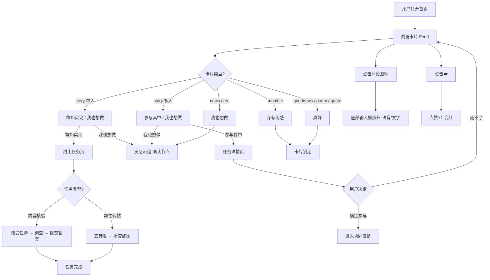
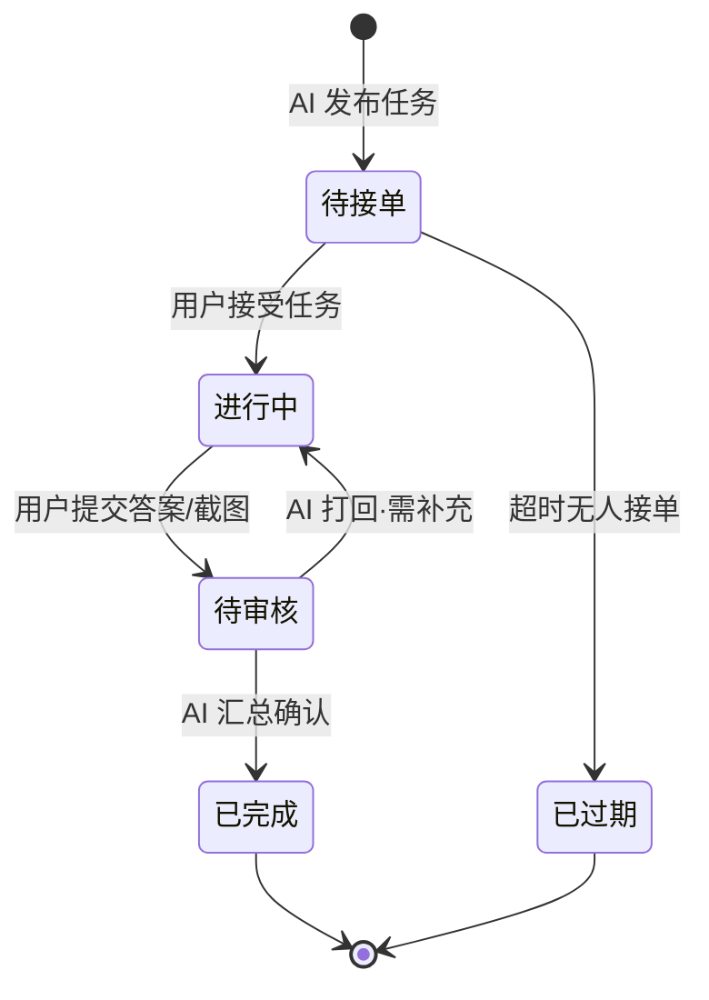

# 产品需求文档：许愿池首页 Feed 内容流 - V2.1

> **🗂️ 文档状态：已归档**
> **替代文档：** `docs/prd/PRD-wishpool-v3.md`
> **归档时间：** 2026-03-28
> **归档原因：** 已整合至 V3.0，解决编号冲突和需求重叠问题

> 版本：V2.1
> 状态：需求确认完成，待实现
> 更新日期：2026-03-20
> 关联文档：[V2.0 PRD](../PRD-wishpool-v2.md)

---

## 1. 综述 (Overview)

### 1.1 项目背景与核心问题

V2.0 的首页以"别人的愿望故事"为单一内容类型，内容同质、互动弱，用户浏览几张后容易失去新鲜感，留存率存在瓶颈。

V2.1 的核心目标是：
1. **扩展内容多样性**：引入 7 种内容类型（愿望故事、碎碎念、好消息、本地推荐、全球好消息、小诗、金句），让首页 Feed 有生命力
2. **引入轻量互动**：评论、点赞、"深有同感"、"真好"等低门槛参与方式，提升留存
3. **将用户转化为贡献者**：通过"帮Ta实现"线上任务（内容核验、帮忙转帖），形成社区飞轮

### 1.2 核心业务流程 / 用户旅程地图

1. **阶段一：Feed 内容展示** — 用户打开首页，浏览多种类型卡片
2. **阶段二：主动互动** — 用户对卡片执行主按钮操作，触发 5 种不同行为分支
3. **阶段三："帮Ta实现"线上任务** — 用户接受信息探索或帮忙扩散任务并完成
4. **阶段四：通用能力** — 评论、点赞（所有卡片通用）

### 1.3 Mermaid 图

#### 1.3.1 用户操作流（必填）



#### 1.3.2 状态机（"帮Ta实现"任务生命周期）



---

## 2. 用户故事详述 (User Stories)

### 阶段一：Feed 内容展示

---

#### **US-V21-01: 作为首页浏览用户，我希望看到多种类型的内容卡片，以便在浏览中获得新鲜感并自然产生互动欲望**

- **价值陈述 (Value Statement)**:
  - **作为** 首页浏览用户
  - **我希望** 看到愿望故事、碎碎念、好消息、小诗、金句等多种内容类型
  - **以便于** 首页不再单调，每次打开都有新鲜感
- **业务规则与逻辑 (Business Logic)**:
  1. **前置条件**: 用户已进入首页，Feed 数据已加载
  2. **操作流程 (Happy Path)**:
     1. 首页每次展示一张卡片，全屏聚焦
     2. 左右滑动切换卡片（右滑同时触发"收藏"语义）
     3. 进度指示器显示当前第几张（如 `3 / 12`）
     4. 不同类型的卡片有对应的视觉差异（详见线框图）
  3. **内容类型定义**:

     | 类型标识 | 标签 | 来源 | 视觉风格 |
     |---------|------|------|---------|
     | `story`（单人） | 愿望故事 | 社区用户 | 封面图 + 摘要 + meta 信息 |
     | `story`（多人） | 愿望故事·众筹 | 社区用户 | 同上，含"X人助力"角标 |
     | `mumble` | 碎碎念 | 社区用户 | 封面图 + 短文字 |
     | `news` / `rec` | 好消息 / 本地推荐 | AI 推荐 | 封面图 + 摘要 |
     | `goodnews` | 🌍 全球好消息 | AI 推荐 | 封面图 + 摘要 + 来源链接 |
     | `poem` | ✨ 小诗一首 | AI 生成 | 无封面图，纯色渐变背景，大字居中 |
     | `quote` | 💬 今日金句 | AI 生成 | 无封面图，纯色渐变背景，大引号排版 |

  4. **异常/降级**:
     - 无内容时展示示例卡片（冷启动兜底）
     - 网络断开时展示本地缓存的最近一批卡片，底部提示"已离线"
- **验收标准 (Acceptance Criteria)**:
  - **场景1: 正常浏览**
    - **GIVEN** 用户打开首页，Feed 加载完成
    - **WHEN** 用户左右滑动
    - **THEN** 卡片顺序切换，进度指示器同步更新
  - **场景2: poem/quote 卡片渲染**
    - **GIVEN** 当前卡片类型为 `poem` 或 `quote`
    - **WHEN** 卡片展示
    - **THEN** 不显示封面图，背景为纯色渐变，文字大字居中展示，无 excerpt 字段

---
- **页面布局线框图 (ASCII Wireframe)**:

  ```text
  ┌─────────────────────────────────┐
  │  许愿池                    🔔   │
  ├─────────────────────────────────┤
  │         3 / 12  ● ● ○ ○ ○      │
  │                                 │
  │  ┌───────────────────────────┐  │
  │  │  [封面图]                 │  │
  │  │                           │  │
  │  │  ✨ 小诗一首              │  │  ← poem/quote 类型无封面图，
  │  │  ─────────────────────    │  │    替换为渐变色背景 + 大字
  │  │                           │  │
  │  │  「我许了个愿             │  │
  │  │    风把它吹走了           │  │
  │  │    但风也把它吹给了某人」 │  │
  │  │                           │  │
  │  │  ─────────────────────    │  │
  │  │                           │  │
  │  │  [真好]              ❤️ 3 │  │  ← 按钮区（见 US-V21-02）
  │  │  [💬 评论]                │  │
  │  └───────────────────────────┘  │
  │                                 │
  │    ←  左右滑动浏览  →           │
  │                                 │
  ├─────────────────────────────────┤
  │      + 说出你的心愿             │
  └─────────────────────────────────┘

  ── story 类型卡片 ──────────────────
  ┌───────────────────────────────┐
  │  [封面图]                     │
  │                               │
  │  愿望故事                     │
  │  ──────────────────────────   │
  │  "第一次滑雪，找到了同频搭子" │
  │                               │
  │  3人助力 · 8天完成            │
  │  北京 · 上周                  │
  │  ──────────────────────────   │
  │  [参与其中 →] [我也想做]  ❤️  │
  │  [💬 评论]                    │
  └───────────────────────────────┘

  ── goodnews 类型卡片 ───────────────
  ┌───────────────────────────────┐
  │  [封面图]                     │
  │                               │
  │  🌍 全球好消息                │
  │  ──────────────────────────   │
  │  "英国一只三条腿的猫成为      │
  │   养老院治愈系明星"           │
  │                               │
  │  🔗 来源：bbc.com             │
  │  ──────────────────────────   │
  │  [真好]                   ❤️  │
  │  [💬 评论]                    │
  └───────────────────────────────┘
  ```

---

### 阶段二：主动互动

---

#### **US-V21-02: 作为浏览用户，我希望对不同卡片看到对应的行动按钮，以便用最匹配的方式参与**

- **价值陈述 (Value Statement)**:
  - **作为** 浏览中的用户
  - **我希望** 每种卡片底部展示最匹配语境的按钮文案
  - **以便于** 降低决策成本，自然产生参与行为
- **业务规则与逻辑 (Business Logic)**:
  1. **前置条件**: 卡片已渲染完成
  2. **按钮映射规则**:

     | 卡片类型 | 主按钮（左） | 次按钮（中） | 通用（右） |
     |---------|------------|------------|---------|
     | `story` 单人（AI直出） | 帮Ta实现 → | 我也想做 | ❤️ |
     | `story` 多人（含"助力"） | 参与其中 → | 我也想做 | ❤️ |
     | `mumble` 碎碎念 | 深有同感 | — | ❤️ |
     | `news` / `rec` | 我也想做 → | — | ❤️ |
     | `goodnews` / `poem` / `quote` | 真好 | — | ❤️ |

  3. **"我也想做"行为**:
     - 非会员：触发付费墙
     - 会员：进入发愿流程，**跳至"心愿确认"节点**（跳过 AI 追问阶段），将当前卡片内容预填为心愿
  4. **"深有同感" / "真好"行为**:
     - 点击后卡片立即划走，进入下一张
     - 不触发任何跳转，无需加载
  5. **多人/单人判断逻辑**:
     - 卡片 meta 字段包含"助力"关键词（如"3人助力"）→ 判定为多人任务
     - 否则判定为单人/AI直出
  6. **异常处理**:
     - 按钮点击后网络断开：toast 提示"网络不稳定，请稍后重试"，保持当前卡片不划走
- **验收标准 (Acceptance Criteria)**:
  - **场景1: 碎碎念点击"深有同感"**
    - **GIVEN** 当前卡片类型为 `mumble`
    - **WHEN** 用户点击"深有同感"
    - **THEN** 卡片立即划走，展示下一张，无跳转无弹窗
  - **场景2: 非会员点击"我也想做"**
    - **GIVEN** 用户未开通会员，当前卡片类型为 `story`
    - **WHEN** 用户点击"我也想做"
    - **THEN** 触发付费墙页面，不进入发愿流程
  - **场景3: 多人故事按钮正确渲染**
    - **GIVEN** 卡片 meta 包含"3人助力"
    - **WHEN** 卡片渲染
    - **THEN** 主按钮显示"参与其中 →"，次按钮显示"我也想做"

---

#### **US-V21-03: 作为浏览用户，我希望点击"参与其中"后看到任务详情，以便决定是否加入**

- **价值陈述 (Value Statement)**:
  - **作为** 看到多人任务故事的用户
  - **我希望** 点击后看到任务的完整信息
  - **以便于** 做出知情决策：加入还是跳过
- **业务规则与逻辑 (Business Logic)**:
  1. **前置条件**: 当前卡片为 `story` 多人任务类型，用户已点击"参与其中"
  2. **操作流程 (Happy Path)**:
     1. 底部弹出任务详情半页弹窗（half-sheet）
     2. 展示：发起人头像/昵称、心愿描述、当前参与人数、预计时间/地点（若有）、任务要求简述
     3. 用户选择「确定参与」→ 通知发起人，进入协同筹备流程（同 US-05）
     4. 用户选择「先不了」→ 弹窗关闭，回到当前卡片
  3. **异常处理**:
     - 任务已满员：弹窗内提示"名额已满，可加入候补"，「确定参与」变为「加入候补」
     - 任务已结束：弹窗内提示"活动已结束"，只保留「关闭」按钮
- **验收标准 (Acceptance Criteria)**:
  - **场景1: 正常参与**
    - **GIVEN** 任务仍有名额，用户点击"参与其中"
    - **WHEN** 弹窗展示后用户点击「确定参与」
    - **THEN** 弹窗关闭，进入协同筹备流程，发起人收到通知
  - **场景2: 任务已满**
    - **GIVEN** 任务名额已满，用户点击"参与其中"
    - **WHEN** 弹窗展示
    - **THEN** 显示"名额已满，可加入候补"，按钮变为「加入候补」

---
- **页面布局线框图 (ASCII Wireframe)**:

  ```text
  ┌─────────────────────────────────┐
  │  许愿池                    🔔   │  ← 背景卡片（半透明遮罩）
  │  ┌─────────────────────────┐   │
  │  │  [卡片内容 · 模糊]      │   │
  │  └─────────────────────────┘   │
  ├─────────────────────────────────┤
  │  ╔═════════════════════════╗   │
  │  ║  任务详情               ✕ ║  │
  │  ╠═════════════════════════╣   │
  │  ║  👤 小王  ·  3人参与中  ║   │
  │  ║                         ║   │
  │  ║  "第一次去滑雪，找同频  ║   │
  │  ║   搭子一起"             ║   │
  │  ║                         ║   │
  │  ║  📅 时间：下周末        ║   │
  │  ║  📍 地点：北京南山滑雪场║   │
  │  ║                         ║   │
  │  ║  要求：初学者友好，会   ║   │
  │  ║  基本滑行即可           ║   │
  │  ║                         ║   │
  │  ║  [ 先不了 ]  [ 确定参与]║   │
  │  ╚═════════════════════════╝   │
  └─────────────────────────────────┘
  ```

---

### 阶段三："帮Ta实现"线上任务

---

#### **US-V21-04: 作为有探索欲的用户，我希望接受"内容核验"任务去调查一个信息缺口，以便为社区贡献有价值的第一手信息**

- **价值陈述 (Value Statement)**:
  - **作为** 有探索欲、愿意行动的用户
  - **我希望** 看到 AI 或其他用户提出的"信息悬赏"
  - **以便于** 用我的实际行动填补这个信息空白，并获得成就感
- **业务规则与逻辑 (Business Logic)**:
  1. **前置条件**: 用户点击 `story` 单人卡片上的"帮Ta实现"，当前任务类型为内容核验
  2. **任务来源两种子类型**:

     | 子类型 | 来源 | 任务描述示例 |
     |--------|------|------------|
     | AI 发现型 | AI 自主发现内容空白 | "我也不知道老顾客煲仔饭和嘉华小吃哪个更好吃，有人能去比比吗？" |
     | 愿望衍生型 | 某用户愿望衍生，AI 代Ta发出 | "有人想去云南但不确定雨季适不适合旅行，有去过的人能告诉我们吗？" |

  3. **操作流程 (Happy Path)**:
     1. 点击"帮Ta实现"后展示任务卡（底部半页弹窗或新页面）
     2. 任务卡展示：任务类型标签「信息探索」、AI 提问内容（自然语言第一人称）、发起方（AI发现型 / 用户昵称）、截止时间（若有）
     3. 用户选择「接受任务」→ 弹出提示"去完成后回来提交你的答案"，任务进入「进行中」状态
     4. 用户完成实地调查/搜索后，回到 App 提交答案（文字/图片/语音）
     5. AI 汇总多份答案 → 更新原卡片内容 → 通知发起方
  4. **异常处理**:
     - 用户选择「放弃」→ 弹窗关闭，任务状态不变，仍可被其他用户接单
     - 任务已有答案（已被完成）→ 任务卡显示"已有 X 人提交答案"，仍可继续提交补充视角
     - 用户提交空内容 → 提示"请输入你的发现"，禁用提交按钮
- **验收标准 (Acceptance Criteria)**:
  - **场景1: 成功接单并提交**
    - **GIVEN** 用户点击"帮Ta实现"，任务类型为内容核验
    - **WHEN** 用户接受任务，完成调查后提交文字答案
    - **THEN** 提交成功，任务状态变为「待审核」，原卡片标注"已有答案"
  - **场景2: 放弃任务**
    - **GIVEN** 用户看完任务卡
    - **WHEN** 点击「放弃」
    - **THEN** 弹窗关闭，回到原卡片，任务状态不变

---
- **页面布局线框图 (ASCII Wireframe)**:

  ```text
  ┌─────────────────────────────────┐
  │  ╔═════════════════════════╗   │
  │  ║  🔍 信息探索任务    ✕  ║   │
  │  ╠═════════════════════════╣   │
  │  ║                         ║   │
  │  ║  来自：AI 发现           ║   │  ← 或"来自：小王"（愿望衍生型）
  │  ║                         ║   │
  │  ║  "我也不知道老顾客煲仔  ║   │
  │  ║   饭和嘉华小吃哪个更好  ║   │
  │  ║   吃，有人能去比比吗？" ║   │
  │  ║                         ║   │
  │  ║  ⏰ 截止：3天后          ║   │
  │  ║  👥 已有 2 人接单        ║   │
  │  ║                         ║   │
  │  ║  [ 放弃 ]  [ 接受任务 ] ║   │
  │  ╚═════════════════════════╝   │
  └─────────────────────────────────┘

  ── 提交答案页 ──────────────────────
  ┌─────────────────────────────────┐
  │  ← 返回              提交答案   │
  ├─────────────────────────────────┤
  │  任务：老顾客 vs 嘉华煲仔饭     │
  │  ─────────────────────────────  │
  │                                 │
  │  ┌─────────────────────────┐   │
  │  │  写下你的发现...        │   │
  │  │                         │   │
  │  │                         │   │
  │  └─────────────────────────┘   │
  │                                 │
  │  [📷 添加图片]  [🎤 语音输入]   │
  │                                 │
  │  ──────────────────────────     │
  │           [ 提交答案 ]          │
  └─────────────────────────────────┘
  ```

---

#### **US-V21-05: 作为乐于助人的用户，我希望帮忙将内容转发扩散，以便帮助他人或好内容被更多人看到**

- **价值陈述 (Value Statement)**:
  - **作为** 愿意花 1 分钟帮助他人的用户
  - **我希望** 接受"帮忙转帖"任务，将指定内容发到我常用的平台
  - **以便于** 以最低成本为社区贡献传播力
- **业务规则与逻辑 (Business Logic)**:
  1. **前置条件**: 用户点击"帮Ta实现"，当前任务类型为帮忙转帖
  2. **操作流程 (Happy Path)**:
     1. 任务卡展示：任务类型标签「帮忙扩散」、待转发内容预览（文字/图片/链接）、目标平台（微博/小红书/朋友圈等）、转发要求（可选：加某话题/at某人）
     2. 用户点击「去转发」→ 跳转/唤起对应 App（deeplink）或自动复制内容到剪贴板
     3. 用户在目标平台完成转发后，回到 App
     4. 用户提交截图或点击「已完成」→ 任务标记完成
  3. **异常处理**:
     - 无法唤起目标 App → 自动复制内容到剪贴板，提示"内容已复制，请手动粘贴到 [平台名]"
     - 用户未提交确认直接返回 → 任务保持「进行中」，下次打开 App 提醒未完成任务
- **验收标准 (Acceptance Criteria)**:
  - **场景1: 成功转发**
    - **GIVEN** 用户接受帮忙转帖任务，目标平台为小红书
    - **WHEN** 用户点击「去转发」，完成后返回并点击「已完成」
    - **THEN** 任务标记完成，用户获得完成反馈（如动画/积分）
  - **场景2: 无法唤起 App**
    - **GIVEN** 设备未安装目标平台 App
    - **WHEN** 用户点击「去转发」
    - **THEN** 内容自动复制到剪贴板，toast 提示"内容已复制，请手动粘贴到微博"

---
- **页面布局线框图 (ASCII Wireframe)**:

  ```text
  ┌─────────────────────────────────┐
  │  ╔═════════════════════════╗   │
  │  ║  📢 帮忙扩散任务    ✕  ║   │
  │  ╠═════════════════════════╣   │
  │  ║                         ║   │
  │  ║  目标平台：小红书        ║   │
  │  ║                         ║   │
  │  ║  转发内容预览：          ║   │
  │  ║  ┌───────────────────┐  ║   │
  │  ║  │ [图片缩略图]      │  ║   │
  │  ║  │ "第一次滑雪超有趣 │  ║   │
  │  ║  │  推荐南山！#滑雪" │  ║   │
  │  ║  └───────────────────┘  ║   │
  │  ║                         ║   │
  │  ║  要求：带话题 #滑雪搭子  ║   │
  │  ║                         ║   │
  │  ║  [ 放弃 ]  [ 去转发 ]  ║   │
  │  ╚═════════════════════════╝   │
  └─────────────────────────────────┘
  ```

---

### 阶段四：通用能力

---

#### **US-V21-06: 作为任意浏览用户，我希望对每张卡片发表评论，以便留下我的感受或补充信息**

- **价值陈述 (Value Statement)**:
  - **作为** 任意浏览中的用户
  - **我希望** 点击评论图标后快速输入文字或语音
  - **以便于** 和内容发起者或其他浏览者产生互动
- **业务规则与逻辑 (Business Logic)**:
  1. **前置条件**: 用户在任意卡片上，已看到评论图标（💬）
  2. **操作流程 (Happy Path)**:
     1. 用户点击 💬 图标 → 底部评论输入区域展开，键盘弹出
     2. 底部 bar 文案：「长按语音输入」
     3. 两种输入方式：
        - **文字输入**：点击输入框 → 弹出键盘，正常文字输入
        - **语音输入**：长按「长按语音输入」区域 → 录音中（波形动画）→ 松手 → 自动转文字填入输入框
     4. 用户点击「发送」→ 评论提交，输入区收起，卡片评论数 +1
  3. **异常处理**:
     - 语音转文字失败 → 提示"识别失败，请重试或文字输入"
     - 提交空评论 → 「发送」按钮禁用，不可提交
     - 网络断开 → 提交失败时 toast 提示"发送失败，请检查网络"，保留输入内容
- **验收标准 (Acceptance Criteria)**:
  - **场景1: 文字评论成功**
    - **GIVEN** 用户点击任意卡片的 💬 图标
    - **WHEN** 输入文字后点击「发送」
    - **THEN** 评论展示在卡片，评论数 +1，输入区收起
  - **场景2: 语音输入**
    - **GIVEN** 评论输入区已展开
    - **WHEN** 用户长按「长按语音输入」区域，说话后松手
    - **THEN** 识别文字自动填入输入框，用户可编辑后发送

---
- **页面布局线框图 (ASCII Wireframe)**:

  ```text
  ┌─────────────────────────────────┐
  │  [卡片内容区·缩小]              │
  │                                 │
  ├─────────────────────────────────┤  ← 键盘弹出，卡片内容上移
  │  ┌─────────────────────────┐   │
  │  │  说点什么...            │   │  ← 文字输入框
  │  └─────────────────────────┘   │
  │                                 │
  │  ████████████████████████████  │  ← 长按语音输入区（松手转文字）
  │       长按语音输入              │
  │                                 │
  │  ──────────────────── [ 发送 ] │
  └─────────────────────────────────┘
  ```

---

#### **US-V21-07: 作为浏览用户，我希望对喜欢的卡片点赞，以便快速表达认同并影响内容推荐权重**

- **价值陈述 (Value Statement)**:
  - **作为** 浏览中的用户
  - **我希望** 用一次点击表达"我喜欢这个"
  - **以便于** 以最低成本参与互动，并帮助好内容被更多人看到
- **业务规则与逻辑 (Business Logic)**:
  1. **前置条件**: 用户在任意卡片上，卡片右下角有 ❤️ 按钮
  2. **操作流程**:
     1. 点击 ❤️ → 变为红色填充，计数 +1，小动画反馈（弹跳/缩放）
     2. 再次点击 → 取消点赞，变回灰色，计数 -1
  3. **状态持久化**: 点赞状态在 session 内保持，刷新后从服务端同步
- **验收标准 (Acceptance Criteria)**:
  - **场景1: 点赞**
    - **GIVEN** ❤️ 当前为未点赞状态（灰色）
    - **WHEN** 用户点击
    - **THEN** 变为红色，计数 +1，有动画反馈
  - **场景2: 取消点赞**
    - **GIVEN** ❤️ 当前为已点赞状态（红色）
    - **WHEN** 用户再次点击
    - **THEN** 变回灰色，计数 -1

---

## 3. 非目标 (Out of Scope for V2.1)

- 线下任务（踩点/避雷）— 后续版本迭代
- Feed 算法个性化推荐 — V2.1 可用固定顺序兜底
- 评论的回复/点赞 — V2.2 迭代
- "帮Ta实现"的激励体系（积分/勋章）— 后续版本
- 「和我有关的」内容类型（Agent 鼓励/建议、别人夸我）— 后续版本

---

## 4. 验收检查清单

- [ ] 7种内容类型卡片均可正常渲染，无样式溢出
- [ ] `poem` / `quote` 卡片无封面图，纯色渐变背景，大字居中
- [ ] `goodnews` 卡片底部显示来源链接（🔗 来源：xxx.com）
- [ ] 每种卡片的按钮文案符合 US-V21-02 映射表
- [ ] 点击"深有同感"/"真好"后卡片划走，无跳转
- [ ] 点击"我也想做"：非会员 → 付费墙；会员 → 发愿流程确认节点
- [ ] 点击"参与其中" → 底部弹窗展示任务详情，可确认/取消
- [ ] 点击"帮Ta实现" → 展示任务类型卡（内容核验 / 帮忙转帖）
- [ ] 内容核验：接受任务 → 可提交文字/图片/语音答案
- [ ] 帮忙转帖：去转发 → 唤起目标 App 或复制到剪贴板
- [ ] 评论：点击 💬 → 底部输入区展开，支持文字输入，底 bar 显示「长按语音输入」
- [ ] 长按语音输入区域 → 录音 → 松手 → 转文字填入输入框
- [ ] 点赞：点击变红 +1，再次点击取消

---

*文档由对话整理生成，如需调整请继续在对话中说明。*
*V2.0 主文档：[docs/PRD-wishpool-v2.md](../PRD-wishpool-v2.md)*
