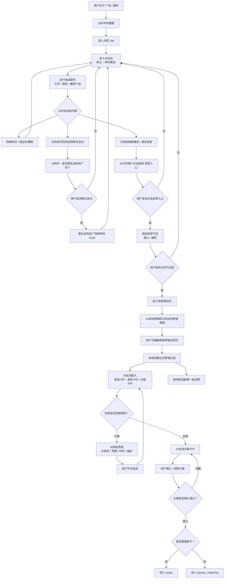
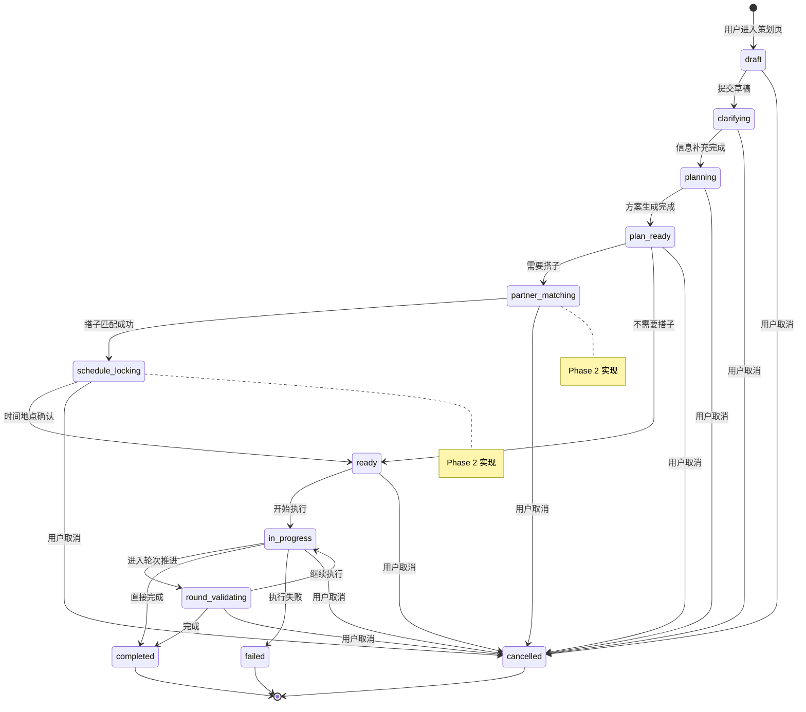

# 心愿发布与深夜交流 — 板块 PRD

> **板块版本**：V1
> **最后更新**：2026-03-29
> **总领 PRD**：[PRD-wishpool-v3.md](PRD-wishpool-v3.md)
> **用户故事**：US-05 ~ US-10

---

## 板块定位

心愿发布是产品的核心链路——从用户说出心愿到心愿落地的完整旅程。中间按钮是这个链路的入口，语音发愿是仪式的开始。

**核心体验**：发愿 → AI方案 → 推进 → 匹配搭子 → 协同 → 履约

---

## 用户故事

### US-05｜智能对话与无感双模式切换

**作为** 许愿池用户
**我想要** 通过对话自然地表达需求，AI 能理解我并引导我完成愿望
**以便于** 降低使用门槛，从随意聊天到愿望实现无缝衔接

**核心设计理念**：对话是一等公民，AI 根据是否挂载愿望无感切换倾听/执行模式

#### **主链路原则**

- **聊天不等于发愿**：聊天流承担倾听、识别和引导，不直接等同于正式愿望创建
- **聊天阶段 AI 只做三件事**：
  - 倾听与追问，帮助用户说清楚当下的情绪和需求
  - 识别可回流的碎碎念金句，并询问用户是否匿名发布到广场
  - 识别到明确需求后，引导用户点击底部**发愿入口**
- **正式发愿入口**：用户点击底部发愿入口时，先唤起**发愿气泡**；用户点击气泡项后，才进入**愿望策划页**
- **愿望草稿预填规则**：AI 将刚刚在聊天中识别出的愿望描述自动预填到策划页，用户可以修改后再提交
- **约束补充范围**：策划页首期只承接愿望描述/目标草稿，城市、预算、时间、偏好等约束放在后续澄清阶段补齐

#### **发愿气泡两态分流规则**

> **核心原则**：荧光条在空状态下提供多选探索，在已被 AI 引导的状态下只承接当前推荐。

- **单击荧光许愿条的动作恒定为**：唤起发愿气泡，不直接进入愿望策划页
- **长按荧光许愿条的动作恒定为**：直接触发语音输入，不受当前是否已有推荐影响

**状态 A：空状态 / 未被 AI 引导**
- 当前会话还没有明确的 IP 推荐时，单击荧光条展示 **4-6 个默认愿望轻量气泡**
- 气泡呈现为 IP 头像旁边的轻量小胶囊，以聊天气泡的飘出感横向排列
- 作用：给用户提供低压力的探索入口，随意选一个方向开始
- 用户点击某个气泡后：进入愿望策划页，带入该模板文案

**状态 B：已引导 / AI 已识别出愿望**
- 当前会话已存在 IP 刚识别出的愿望草稿时，单击荧光条只展示 **单个推荐气泡**
- 作用：承接刚才那轮对话，不再让用户重新做多选
- 用户点击该推荐后：进入愿望策划页，带入 AI 识别的愿望草稿

#### **入口形态**

| 状态 | 许愿入口形态 | 位置 |
|------|------------|------|
| 在广场 / 我的 Tab | 渐变**圆圈** icon | 底 bar 中央 |
| 单击圆圈后（许愿 Tab） | 圆圈**吸附变为荧光条**，文案许愿 | 底 bar 中央，常驻 |

#### **交互流程**

1. **对话入口**：
   - 用户在广场/我的 Tab 单击中央圆圈
   - 内容区切换为**许愿 Tab**（默认进入最近对话聊天流）
   - 底 bar 中央圆圈**吸附变为荧光许愿条**
   - 聊天输入框自动出现在荧光条上方

2. **对话模式**：
   - **单击荧光许愿条** → 输入框上方弹出**发愿气泡**
     - 若当前已有 IP 推荐 → 展示**推荐气泡**
     - 若当前还没有 IP 推荐 → 展示**默认气泡**
   - **长按荧光许愿条** → 直接触发语音输入
   - **点击左上角 ☰** → 进入对话列表（切换 IP / 群聊）

3. **对话列表**包含：
   - **IP 对话**：眠眠月、朵朵云、芽芽星等（各有独特个性）
   - **Group 群聊**：搭子群、话题群等

#### **发愿主流程图**

#### **双模式AI对话系统**

**倾听模式**（默认状态，无挂载愿望）：
- **角色定位**：温暖的树洞，善于感知情绪和需求
- **回应风格**：共情、温柔追问、不急于给建议
- **核心能力**：情感识别、需求感知、轻柔引导
- **示例交互**：
  - 用户："最近工作好累"
  - AI："能感受到你的疲惫...是工作强度太大了吗？还是有什么特别困扰你的事情？"
- **碎碎念转化机制**：AI 在倾听对话中主动识别并提炼用户的情感金句，对话结束后主动询问用户是否将其匿名化为「碎碎念」丢进广场
  - AI 主动推送："你刚才说的'有时候停下来比继续更需要勇气'，要不要匿名丢进广场？也许其他人也需要这句话。"
  - 用户一键确认后，以匿名身份发布到广场碎碎念 Feed，广场显示来源为「某人的碎碎念」，无头像、无昵称、无微信身份关联
- **发愿引导机制**：当感知到明确需求时，AI 不直接创建愿望，而是通过文字引导用户点击底部发愿入口
  - "听起来你想要一个完全放松的周末...要不要点一下下面的【发愿】把它整理成正式愿望？"

**执行模式**（挂载愿望后自动切换）：
- **角色定位**：贴心的执行伙伴，熟悉愿望背景
- **回应风格**：具体、实用、推进导向
- **核心能力**：方案拆解、进度跟踪、问题解决
- **示例交互**：
  - 用户："今天没有练吉他"
  - AI："没关系，周末可以补上。要不要调整一下练习时间？我记得你之前说晚上比较有空..."

#### **IP角色个性化**

**眠眠月**：
- **个性**：温柔细腻，善于倾听情感
- **倾听模式**：更多情感共鸣，关注用户内心感受
- **执行模式**：温和地推进，注重心理建设

**芽芽星**：
- **个性**：活泼积极，喜欢行动
- **倾听模式**：积极乐观，善于发现机会
- **执行模式**：充满干劲，专注目标达成

**朵朵云**：
- **个性**：理性客观，善于分析
- **倾听模式**：逻辑清晰，善于梳理思路
- **执行模式**：系统化推进，重视计划和效率

#### **愿望转化机制**

**方式1：引导进入策划页**
- AI感知需求 → 文字引导 → 用户点击底部发愿入口 → 唤起发愿气泡 → 点击气泡项 → 进入愿望策划页 → AI自动预填愿望草稿 → 用户修改/确认后提交

**方式2：AI代拟愿望草稿**
- AI感知需求 → AI先整理一版愿望草稿 → 引导用户点击发愿入口 → 唤起推荐气泡 → 用户点击该推荐项 → 策划页自动带入草稿 → 用户修改后提交为正式愿望

**关键原则**：
- AI只通过文字引导，不在聊天流里直接创建愿望
- 转化的主动权在用户手上
- 发愿必须通过底部发愿入口唤起发愿气泡，并在点击气泡项后进入正式策划页
- 策划页的自动预填仅限愿望描述/目标草稿

#### **验收标准**

**基础对话**：
- [ ] 广场/我的 Tab 底 bar 中央显示渐变圆圈
- [ ] 单击圆圈后内容区切换为许愿 Tab，圆圈变为荧光许愿条
- [ ] 荧光许愿条单击弹出发愿气泡（位于输入框上方）
- [ ] **两态逻辑**：空状态展示 4-6 个默认愿望轻量气泡；已引导状态只展示单个推荐气泡
- [ ] 气泡以 IP 头像 + 轻量小胶囊形式飘出，位于输入框上方
- [ ] 荧光许愿条长按触发语音输入
- [ ] 许愿 Tab 左上角 ☰ 可进入对话列表
- [ ] 对话列表显示 IP 角色和群聊，支持切换

**双模式切换**：
- [ ] 无挂载愿望时AI展现倾听模式（温暖、共情、引导）
- [ ] 挂载愿望后AI自动切换执行模式（具体、推进、目标导向）
- [ ] 模式切换对用户无感，界面保持一致
- [ ] AI回应风格明显区分两种模式

**碎碎念回流**：
- [ ] AI可在倾听对话中识别可回流的碎碎念金句
- [ ] AI在发布前必须询问用户是否匿名回流广场
- [ ] 用户拒绝发布后，不影响当前聊天继续进行
- [ ] 用户确认发布后，以匿名形式进入广场，不触发愿望创建

**IP角色个性**：
- [ ] 三个IP角色（月/星/云）有明显不同的回应风格
- [ ] 每个角色在倾听/执行两个模式都保持一致的个性
- [ ] 角色切换后对话风格相应变化

**愿望转化**：
- [ ] AI能识别对话中的需求点
- [ ] 通过文字自然引导用户点击底部发愿入口，而非在聊天流里直接创建愿望
- [ ] 发愿入口在合适时机出现，不突兀
- [ ] 点击发愿入口后先唤起发愿气泡，而不是直接进入愿望策划页
- [ ] 用户点击气泡项后进入愿望策划页
- [ ] AI会将刚刚识别出的愿望草稿自动预填到策划页
- [ ] 用户可修改愿望草稿后再提交
- [ ] 愿望提交后才正式进入执行模式

---

### US-06｜AI 直出方案 + 用户确认关键细节

**作为** 许愿池用户
**我想要** AI 为我的心愿生成具体可执行的方案
**以便于** 不用自己费力规划，直接开始行动

**场景描述**：
用户在聊天中点击底部发愿入口后，先看到发愿气泡；用户点击气泡项后，进入愿望策划页。AI 会先把刚刚识别出的愿望草稿自动填入，用户可修改后提交。正式提交后，系统创建愿望记录，并以卡片形式把澄清与方案结果回流到对话流，同时在"我的愿望"中新增一条进程。AI 随后分析愿望内容，生成结构化的执行方案，包括：
- 目标拆解
- 时间安排（优先安排在周末）
- 资源需求
- 执行步骤
- 风险预案

**交互流程（异步模式）**：
1. 用户在聊天流中点击底部发愿入口
2. 系统唤起发愿气泡；用户点击某个气泡项
3. 进入愿望策划页，AI 自动预填刚识别出的愿望草稿
4. 用户可修改草稿并提交，系统创建正式愿望记录
5. **Toast 1 弹出**："愿望已创建，眠眠月正加紧制作方案，完成后会通知你" + [跳转]按钮
   - 用户点击[跳转] → 进入策划详情页（显示"AI思考中"状态）
   - 用户不点击 → 继续聊天，稍后可去"我的愿望"查看
6. **AI 后台异步生成方案**（用户可继续其他操作）
7. **Toast 2 弹出**："方案已生成，点击查看" + [查看]按钮
   - 用户点击[查看] → 进入策划详情页（显示完整方案）
   - 用户不点击 → 去"我的愿望"列表，点击展开 → 进入策划详情页
8. "我的愿望"列表中，未查看的方案显示红点标记
9. 用户可以对方案的关键细节提出调整要求
10. AI 基于反馈优化方案
11. 用户确认最终方案，进入下一步

**验收标准**：
- [ ] 发愿入口点击后先唤起发愿气泡，而不是在聊天流中直接创建愿望
- [ ] 用户点击气泡项后进入愿望策划页
- [ ] 策划页自动预填刚识别出的愿望描述/目标草稿
- [ ] 用户可修改愿望草稿后再提交
- [ ] 城市、预算、时间、偏好等约束不要求在策划页一次填完
- [ ] 用户提交后系统才创建正式愿望记录
- [ ] **Toast 1 弹出**："愿望已创建，眠眠月正加紧制作方案，完成后会通知你" + [跳转]按钮
- [ ] 用户点击[跳转]可进入策划详情页（显示"AI思考中"状态）
- [ ] 用户不点击[跳转]可继续聊天，稍后去"我的愿望"查看
- [ ] AI 在后台异步生成方案（不阻塞用户操作）
- [ ] **Toast 2 弹出**："方案已生成，点击查看" + [查看]按钮（通过后端推送触发）
- [ ] 用户点击[查看]可进入策划详情页（显示完整方案）
- [ ] "我的愿望"列表中，未查看的方案显示红点标记
- [ ] 数据库新增 `plan_viewed_at` 字段标记用户是否查看过方案
- [ ] AI 生成方案包含目标、时间、步骤、资源
- [ ] 方案展示清晰，结构化呈现
- [ ] 用户可针对具体环节提出调整意见
- [ ] AI 能基于反馈调整方案
- [ ] 确认方案后状态更新为"planning"

---

### 状态机定义

**核心原则**: 许愿状态定义是 PRD、demo、数据库三层的权威参考,所有实现必须与此对齐。

#### 状态列表

| 状态 | 语义 | Phase | 说明 |
|------|------|-------|------|
| `draft` | 策划页草稿 | Phase 1 | 用户在策划页编辑中,尚未提交 |
| `clarifying` | AI 澄清约束 | Phase 1 | AI 补充城市/预算/时间/偏好等信息 |
| `planning` | AI 生成方案中 | Phase 1 | AI 正在后台异步生成执行方案 |
| `plan_ready` | 方案待确认 | Phase 1 | 方案已生成,等待用户查看和确认 |
| `partner_matching` | 搭子匹配中 | Phase 2 | 需要搭子,正在匹配中(占位) |
| `schedule_locking` | 协同筹备中 | Phase 2 | 确认时间地点分工(占位) |
| `ready` | 准备就绪 | Phase 1 | 方案确认,不需要搭子,等待执行 |
| `in_progress` | 履约中 | Phase 1 | 正在执行愿望 |
| `round_validating` | 轮次推进中 | Phase 1 | 48h 轮次校验,跟踪进度 |
| `completed` | 已完成 | Phase 1 | 愿望已完成 |
| `failed` | 失败 | Phase 1 | 愿望执行失败 |
| `cancelled` | 已取消 | Phase 1 | 用户主动取消 |

#### 状态流转图

#### Phase 1 / Phase 2 边界

**Phase 1 (当前实现)**:
- `draft` → `clarifying` → `planning` → `plan_ready` → `ready` → `in_progress` → `round_validating` → `completed`
- 不包含搭子匹配和协同筹备

**Phase 2 (后续实现)**:
- 补充 `partner_matching` 和 `schedule_locking` 状态
- 实现搭子邀请、匹配、协同筹备完整链路

---

### US-07｜48h 轮次推进与校验

**作为** 许愿池用户
**我想要** 系统定期推进我的愿望进展
**以便于** 保持执行节奏，不让计划搁置

**场景描述**：
方案确认后，系统每48小时主动询问用户进展，提供针对性建议，帮助用户保持执行节奏。如果用户多次无响应，系统会降低推进频率或建议调整计划。

**交互流程**：
1. 方案确认后，系统设置48小时后的第一次轮次
2. 时间到达时，向用户发送推进消息
3. 用户更新进展：顺利进行/遇到困难/需要调整计划
4. 系统基于反馈给出下一步建议
5. 设置下一个48小时轮次

**验收标准**：
- [ ] 系统自动在48小时后发送推进消息
- [ ] 用户可快速选择进展状态
- [ ] 系统基于状态提供个性化建议
- [ ] 连续无响应会调整推进频率
- [ ] 记录轮次历史，用户可查看

---

### US-08｜搭子邀请

**作为** 许愿池用户
**我想要** 邀请我认识的人一起完成心愿
**以便于** 增加执行动力，享受熟人协同完成的乐趣

**场景描述**：
用户在心愿推进过程中可以选择邀请已有的联系人（微信好友、小红书关注、通讯录等）成为搭子，也可以发广场等陌生搭子，或者先自己独立完成。由于第一版不沉淀社交关系，邀请通过生成链接以复制方式分发到外部平台完成。

**邀请逻辑**：
- **不沉淀社交关系**：APP 内部不维护独立的好友列表，显示的是带来源标签的示意联系人
- **来源标签**：联系人卡片显示来源（微信 / 小红书 / 即刻 / 通讯录 / QQ / 广场 等）；家人身份以独立标签展示（如姐姐、表哥）
- **按最近活动排序**：联系人列表按最近一次共同活动时间降序排列
- **邀请链路**：选中好友后点击"发送邀请"，系统自动生成邀请链接并复制，用户自行前往对应平台发送给好友
- **广场匹配**：可选择不发邀请，直接发广场等待陌生搭子响应
- **取消邀请**：可选择不邀请任何人，先自己推进愿望

**交互流程**：
1. 用户在心愿推进中选择"邀请搭子"
2. 系统展示联系人列表（好友/家人合并，带来源标签与家人标识，按最近活动时间排序）
3. 用户可多选好友，或向下滑动看到列表末尾的两个操作项：
   - **取消邀请**：不邀请任何人，独自推进
   - **发广场等搭子**：把心愿发到广场匹配陌生搭子
4. 点击"发送邀请（n人）"后，系统生成邀请链接并提示"邀请链接已生成，去微信/小红书发给他们"
5. 点击"发广场等搭子"后，系统提示"已发布到广场，等待搭子响应（链接已复制）"
6. 点击"继续（不邀请）"后，系统提示"已取消邀请，这一愿望先自己推进"

**验收标准**：
- [ ] 联系人列表展示来源标签（微信 / 小红书 / 即刻 / 通讯录 / QQ / 广场等）
- [ ] 家人身份以独立标签展示，与普通好友在同一列表中
- [ ] 列表按最近共同活动时间降序排列
- [ ] 列表末尾提供「取消邀请」和「发广场等搭子」两个选项
- [ ] 选择好友后主按钮显示"发送邀请（n人）"
- [ ] 点击发送后生成并复制邀请链接，给出清晰的下一步引导 toast
- [ ] 第一版不沉淀社交关系，邀请通过外链形式分发

---

### US-09｜协同筹备

**作为** 许愿池用户
**我想要** 与搭子协商确定执行时间
**以便于** 确保双方都能参与，避免时间冲突

**场景描述**：
搭子匹配成功后，双方需要协商具体的执行时间安排。系统提供简单的协商工具，帮助双方快速达成一致。

**交互流程**：
1. 搭子匹配成功后，系统创建协商空间
2. 双方可看到彼此的大概可用时间
3. 发起方提出具体时间建议
4. 搭子回应：接受/提出其他时间/需要协商
5. 最多3轮协商，达成一致后确定执行计划
6. 系统记录最终安排，设置提醒

**验收标准**：
- [ ] 提供简单的时间协商界面
- [ ] 双方可提出和响应时间建议
- [ ] 协商限制在3轮内，避免无限拖延
- [ ] 达成一致后自动设置日历提醒
- [ ] 任何一方可以在执行前取消（需要理由）

---

### US-10｜履约与完成反馈

**作为** 许愿池用户
**我想要** 完成愿望后记录成果并获得反馈
**以便于** 获得成就感，为其他用户提供经验

**交互流程**：
1. 愿望执行时间到达，系统发送履约提醒
2. 用户可标记：已完成/正在进行/遇到困难/取消执行
3. 如选择"已完成"，引导用户上传成果（照片/文字）
4. 系统询问愿望完成度、满意度、是否推荐给他人
5. 可选分享完成经验到心愿广场

**验收标准**：
- [ ] 执行时间自动提醒
- [ ] 提供多种完成状态选择
- [ ] 支持上传成果展示（图文）
- [ ] 收集满意度和推荐度反馈
- [ ] 可选分享经验到社区

---

## 验收总览

| 用户故事 | 优先级 | Phase | 实现状态 |
|---------|--------|-------|---------|
| US-05 语音发愿 | P0 | MVP | ✅ 已实现 |
| US-06 AI方案 | P0 | MVP | ✅ 已实现 |
| US-07 轮次推进 | P0 | MVP | ✅ 已实现 |
| US-08 搭子匹配 | P0 | MVP | ❌ 未实现 |
| US-09 协同筹备 | P0 | MVP | ⚠️ 仅静态 |
| US-10 履约反馈 | P1 | Phase 2 | ❌ 未实现 |
