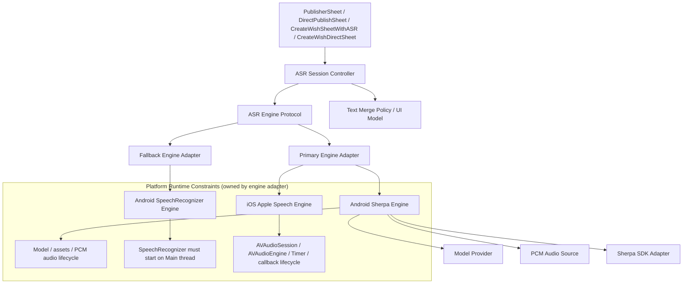
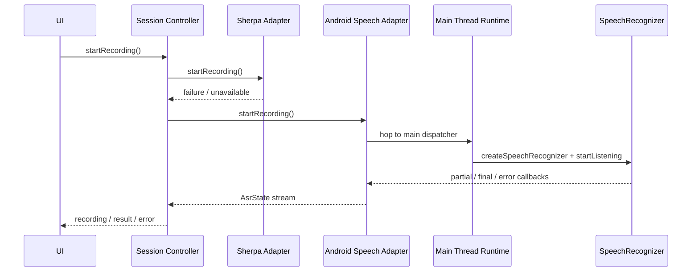

# Cross-Platform ASR Refactor Design

**日期**: 2026-03-31
**范围**: `android/` + `ios/`
**目标**: 收口 Android 与 iOS 的 ASR 子系统边界，统一为“会话控制器 + 引擎适配层 + 文本策略”的架构；iOS 主链路明确固定为 Apple Speech，不再让 Sherpa 概念停留在运行主路径上。

---

## 问题定义

当前 ASR 功能在两端都能“工作”，但存在明显的架构脆弱点：

1. UI 直接驱动录音生命周期，状态切换和权限/降级逻辑容易分散。
2. 引擎装配细节没有硬边界，Android 的文件模式 / assets 模式、iOS 的 Speech / 旧 Sherpa 概念都容易泄露到业务层。
3. 运行时主链路与降级链路虽然存在，但没有统一的 session orchestration。
4. 文本合并、状态展示、引擎选择、权限请求混杂在不同文件中，改动一个点容易牵动整条链路。

---

## 第一性原理

把 ASR 从第一性原理拆开，它实际上由五层连续责任构成：

1. **用户意图层**：用户开始说话、停止说话，期待看到中间态和最终文本。
2. **会话编排层**：决定当前状态是 `idle / recording / processing / result / error`，以及何时触发 fallback。
3. **引擎适配层**：把“开始识别”翻译成平台引擎调用。
4. **平台运行时层**：线程归属、权限、音频会话、计时器、资源释放、回调线程。
5. **平台框架层**：Sherpa、Android `SpeechRecognizer`、Apple Speech、`AVAudioEngine`。

这次 Android 线上问题暴露的，不是第 2 层分层思想错误，而是第 4 层没有被显式写进第 3 层契约。也就是说，ASR adapter 不是“纯算法接口”，而是“平台能力适配器”。

---

## 设计目标

### 1. 会话控制统一

所有录音开始、停止、重置、失败降级都由单一 session controller 负责。

### 2. 引擎边界收紧

- Android：Sherpa / Android Speech 都退到 engine adapter 层。
- iOS：Apple Speech 成为唯一正式运行引擎；旧 Sherpa 相关实现退出主链路。

### 3. UI 只依赖抽象

UI 只感知状态和命令，不感知引擎初始化、权限内部细节或降级策略细节。

### 4. 测试可定位

测试要能分别验证：

- session controller 的状态流转
- engine adapter 的契约行为
- platform runtime constraint 是否被 adapter 正确收口
- UI 文本策略的稳定性
- 跨端主路径的构建与单元验证

---

## 目标架构

### 关键补充：运行时约束归属

这次 Android `SpeechRecognizer` 回退链路暴露出来的根因，不是 session controller 这个分层本身错了，而是 **engine adapter 契约表达得还不够完整**。

- `ASR Session Controller` 只负责会话编排：开始、停止、重置、主链路失败后的 fallback 切换。
- `Engine Adapter` 负责封装平台运行时约束：线程亲和性、系统对象生命周期、回调线程、权限和音频会话。
- UI 只消费 `ASRState` 与命令，不知道平台线程模型。

换句话说，ASR adapter 不是“纯算法接口”，而是“平台能力适配器”。主线程要求、`SpeechRecognizer` 生命周期、`AVAudioSession` 激活时序，都必须被关在 adapter 内部，不能泄露到 session controller，更不能压到 UI。

### Android fallback 时序图

---

## 平台决策

### Android

保留本地 Sherpa 作为主链路，保留系统 SpeechRecognizer 作为降级链路，但将两者都放入 engine adapter 边界，由新的 session controller 统一协调。

**2026-04-01 补充结论：**

- Android `SpeechRecognizer` 在平台上存在显式约束：只能从 Main thread 启动。
- 这条约束必须由 `AndroidAsrManager` / Android engine adapter 自己吸收，不能假设上游调用方一定在主线程。
- 因此 Android 当前问题属于 adapter 运行时封装缺失，不属于整体架构方向错误。
- 2026-04-01 真机追加根因：Sherpa 在 release 包中的 `Failed to get field ID for decodingMethod` 更像是 JNI 依赖的 config 字段被 R8/ProGuard 混淆改名，因此 Android 本地 ASR 还需要把 `com.k2fsa.sherpa.onnx` 作为 JNI 绑定对象显式 keep。
- 2026-04-01 环境追加事实：设备 fallback 实际落到当前系统默认 `voice_recognition_service`；若主链路 Sherpa 失效，行为会受 ROM / 第三方语音服务影响，因此 release 稳定性的第一优先级仍是保住 Sherpa 主链路。

**保留：**

- `AsrState`
- `ModelManager`
- `AudioRecordManager`
- `AsrTextManager`
- 现有 UI 交互样式

**新增：**

- `AsrEngine.kt`
- `AsrSessionController.kt`
- `SherpaAsrEngine.kt`
- `AndroidSpeechAsrEngine.kt`

**调整：**

- `AppContainer` 改为注入 `AsrSessionController`
- `PublisherSheet` / `DirectPublishSheet` 继续依赖 `AsrManager` 抽象，不直接碰 engine

### iOS

明确使用 Apple Speech 作为唯一正式引擎。将现有 `NativeSpeechASRManager` 从“既是 manager 又是 engine”改为“session controller + native engine”的分层。旧 `SherpaASRManager` 不再保留在正式主链路。

**2026-04-01 复核结论：**

- 当前没有发现与 Android 同类的已确认生产问题。
- `NativeSpeechASRManager` 负责状态编排，并通过 `MainActor` 回写 UI 状态。
- `AppleSpeechRecognitionEngine` 已将 `AVAudioSession`、`AVAudioEngine`、静音定时器和 Apple Speech callback 生命周期封装在 engine 内部，这和 Android 需要补上的“平台运行时约束归属”原则是一致的。
- 仍有一个需要显式记录的隐患：`SpeechRecognitionEngine` 协议目前没有把 actor / 线程亲和性写成契约，因此 iOS 虽然暂时没暴露 bug，但后续若替换实现或并发方式变化，仍可能再次踩到平台约束问题。
- 2026-04-01 交付边界追加：iOS 当前可以确认“Apple Speech 主链路 + no-progress watchdog + direct mode retry UX”已经落地，但权限声明闭合、设备能力边界、以及当前机器的 IPA 导出环境仍未完全收口，不能把它表述成“已完整可发布”。

**保留：**

- `ASRState`
- 现有 `CreateWishSheetWithASR` / `CreateWishDirectSheet` 用户体验

**新增：**

- `SpeechRecognitionEngine.swift`
- `AppleSpeechRecognitionEngine.swift`
- 需要时补 `SpeechTextMergePolicy.swift`

**调整：**

- `NativeSpeechASRManager.swift` 收口为 session controller
- `ASRManager.swift` 只保留协议与共享契约
- `SherpaONNXBridge.swift` 退出主链路，必要时标注 legacy / placeholder

---

## 文件结构

### Android

**新建：**

- `android/app/src/main/java/com/wishpool/app/core/asr/AsrEngine.kt`
- `android/app/src/main/java/com/wishpool/app/core/asr/AsrSessionController.kt`
- `android/app/src/test/java/com/wishpool/app/core/asr/AsrSessionControllerTest.kt`

**修改：**

- `android/app/src/main/java/com/wishpool/app/core/asr/SherpaAsrManager.kt`
- `android/app/src/main/java/com/wishpool/app/core/asr/AndroidAsrManager.kt`
- `android/app/src/main/java/com/wishpool/app/app/AppContainer.kt`
- `android/app/src/test/java/com/wishpool/app/core/asr/FallbackAsrManagerTest.kt` 或替代为 controller 测试

**不动：**

- `android/app/src/main/java/com/wishpool/app/feature/home/PublisherSheet.kt`
- `android/app/src/main/java/com/wishpool/app/feature/home/DirectPublishSheet.kt`
- `android/app/src/main/java/com/wishpool/app/core/asr/AsrTextManager.kt`

### iOS

**新建：**

- `ios/Sources/WishpoolCore/SpeechRecognitionEngine.swift`
- `ios/Tests/WishpoolCoreTests/NativeSpeechASRManagerTests.swift`

**修改：**

- `ios/Sources/WishpoolCore/ASRManager.swift`
- `ios/Sources/WishpoolCore/NativeSpeechASRManager.swift`
- `ios/Sources/WishpoolApp/CreateWishSheetWithASR.swift`
- `ios/Sources/WishpoolApp/CreateWishDirectSheet.swift`
- `ios/Package.swift`（如需新增测试目标依赖或 Apple 框架说明）

**不动：**

- `ios/Sources/WishpoolApp/WishCreationFAB.swift`
- `ios/Sources/WishpoolApp/WishpoolAppRootView.swift`

---

## 风险与控制

### 风险 1: Android 重构后退化为“只有主链路能跑，降级失效”

控制：

- 先写 controller 测试，覆盖 primary success / primary error fallback / reset

### 风险 2: iOS 原生 Speech 状态流变化影响 UI

控制：

- 用 session controller 保持 `ASRState` 输出不变
- 保证 `CreateWishSheetWithASR` / `CreateWishDirectSheet` 不需要改交互语义

### 风险 3: 历史 Sherpa 代码在 iOS 留下混淆

控制：

- 从主链路删除 `SherpaASRManager` 角色
- 在文档中明确“iOS 正式 ASR = Apple Speech”

### 风险 4: 平台运行时约束没有写进引擎契约，后续实现可能再次泄漏

控制：

- 在文档和代码评审中明确：线程亲和性 / 音频会话 / 系统对象生命周期都归 engine adapter 所有
- Android 用单测锁定 Main thread 启动 `SpeechRecognizer`
- iOS 后续若继续收紧，可把 `AppleSpeechRecognitionEngine.start/stop/reset` 明确为 `@MainActor` 或增加线程约束测试

---

## 验收标准

### Android

- `./gradlew testDebugUnitTest` 通过
- `./gradlew assembleDebug` 通过
- `AppContainer` 主链路使用 session controller，不再直接注入旧 fallback manager

### iOS

- `swift build` 通过
- `CreateWishSheetWithASR` 与 `CreateWishDirectSheet` 明确使用原生 Speech session controller
- `ASRManager.swift` 中不再保留旧 Sherpa 主实现
- 对 iOS 本机 Speech 链路完成一次线程/运行时约束复核，并给出结论

### 文档

- 本设计文档落盘
- 实施计划文档落盘
- 最终回填执行与验证结果

---

## 执行结果

**状态**: 已完成当前轮重构与本地验证

### Android

- 已落地 `AsrSessionController + AsrEngine` 分层
- `AppContainer` 已切到新的 session controller 主注入链路
- 验证命令：
  - `cd android && ./gradlew testDebugUnitTest assembleDebug`
  - 结果：通过

### iOS

- 已落地 `NativeSpeechASRManager(session controller) + AppleSpeechRecognitionEngine`
- `CreateWishSheetWithASR` 与 `CreateWishDirectSheet` 已显式绑定 Apple Speech 主链路
- 旧 Sherpa 已退出正式运行主路径，只保留最小 legacy bridge 兼容
- 2026-04-01 追加复核：
  - 代码审查结论：暂无与 Android 相同的 Main-thread 启动缺陷
  - `cd ios && swift build`
  - 结果：通过
  - `cd ios && swift test`
  - 结果：当前机器失败，原因是 `/Library/Developer/CommandLineTools` 工具链缺少 `Testing` 模块，不是本次 ASR 复核发现的新功能回归

### 剩余人工验收项

- Android 真机端到端语音识别与 fallback 行为
- iOS 真机权限弹窗、音频会话中断与真实识别体验
