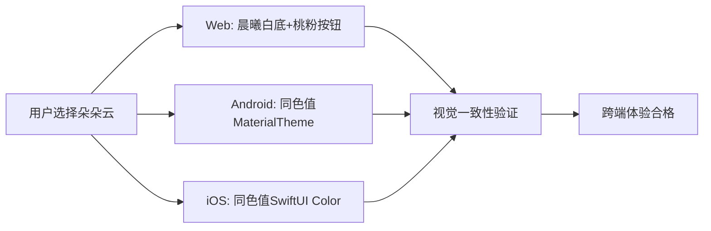

# 主题切换与角色陪伴 — 板块 PRD

> **板块版本**：V1
> **最后更新**：2026-03-29
> **总领 PRD**：[PRD-wishpool-v3.md](PRD-wishpool-v3.md)
> **用户故事**：US-20 ~ US-22

---

## 板块定位

主题切换与角色陪伴承载许愿池的**情绪化差异体验**——"一搭子一宇宙"。它不只是换个皮肤，而是完整的沉浸式情境切换：字体、色彩、动效、呼吸感全部联动变化，让用户在不同心境下获得匹配的陪伴体验。

**核心价值**：情绪价值 → 使用黏性 → 品牌差异化

---

## 三角色设计体系

### 🌙 眠眠月 (Mianmian Yue) — 深夜水墨·月光容器
**定位**：治愈系 / 睡前放松、冥想
**适用场景**：深夜独处、情绪释放、内心对话
**前端实现**：
- **Color Theme**: 深靛蓝黑 `#0A0E1A` 为主，月光金 `#F5C842` 做高亮，月光青 `#4AADA0` 做辅助色
- **Typography**: Noto Serif SC 衬线体，营造杂志级排版质感
- **Motion**: 星空背景闪烁，涟漪交互，径向发散动画，缓呼吸节奏
- **实现状态**: ✅ 三端已实现

### ☁️ 朵朵云 (Duoduo Yun) — 晨曦白昼·植绒呼吸
**定位**：梦幻系 / 心情记录、放松发呆
**适用场景**：白天使用、轻松心境、温暖治愈
**前端实现**：
- **Color Theme**: 晨曦白 `#F0F9FF` 为主，浅桃粉 `#F97066` 做高亮，天蓝 `#60A5FA` 做辅助色
- **Typography**: Fraunces 友好型字体，圆润无锋利感
- **Motion**: 柔和云团浮动，毛玻璃呼吸，云雾扩散涟漪
- **实现状态**: ⚠️ 设计素材已就绪，三端代码待实现

### 🌱 芽芽星 (Yaya Xing) — 深空极光·荧光果冻
**定位**：成长系 / 学习充电、探索新知
**适用场景**：目标导向、技能学习、挑战心愿
**前端实现**：
- **Color Theme**: 太空深紫 `#1A0F2E` 底色，霓虹薄荷绿 `#4ADE80` 穿插，亮青 `#22D3EE` 做辅助色
- **Typography**: Outfit 未来主义字体，圆润转角设计
- **Motion**: 极光流转背景，Q弹悬浮回弹，粒子效果
- **实现状态**: ❌ Phase 3 规划中

---

## 用户故事

### US-20｜角色选择与主题切换

**作为** 许愿池用户
**我想要** 在"我的心愿"页面右上角点击设置，选择不同的陪伴角色
**以便于** 根据当前心境获得匹配的视觉体验和情绪陪伴

**业务规则与逻辑**：
1. 入口位置：我的心愿Tab右上角设置图标
2. 点击后弹出角色选择浮层，展示三个角色卡片
3. 每个角色卡片包含：头像、名称、一句话描述、预览色块
4. 用户点击任意角色卡片即刻切换主题
5. 主题切换后立即保存用户偏好，下次打开App保持选择

**验收标准**：
- [ ] 设置入口在我的心愿Tab右上角，图标清晰可见
- [ ] 角色选择浮层设计美观，三个角色信息完整展示
- [ ] 点击角色后主题立即切换，无闪烁或异常
- [ ] 主题偏好持久化存储，App重启后保持用户选择
- [ ] 三端（Web/Android/iOS）体验一致

```
页面布局线框图：

┌─────────────────┬─────────────────┐
│  ← 我的心愿     │               ⚙️ │  ← 点击这里
├─────────────────┴─────────────────┤
│  [愿望列表内容...]                │
└───────────────────────────────────┘

点击设置图标后：

┌───────────────────────────────────┐
│         选择你的陪伴搭子            │
├───────────────────────────────────┤
│  ┌─────┬─────────────────────┐    │
│  │ 🌙  │ 眠眠月              │    │
│  │     │ 深夜水墨·月光容器    │    │
│  └─────┴─────────────────────┘    │
│  ┌─────┬─────────────────────┐    │
│  │ ☁️  │ 朵朵云              │    │
│  │     │ 晨曦白昼·植绒呼吸    │    │ ← 当前选择高亮
│  └─────┴─────────────────────┘    │
│  ┌─────┬─────────────────────┐    │
│  │ 🌱  │ 芽芽星 (即将上线)    │    │
│  │     │ 深空极光·荧光果冻    │    │
│  └─────┴─────────────────────┘    │
└───────────────────────────────────┘
```

---

### US-21｜三端主题一致性体验

**作为** 许愿池用户
**我想要** 在Web、Android、iOS任意端选择主题后，视觉效果完全一致
**以便于** 享受无缝的跨设备体验，建立稳定的品牌认知

**业务规则与逻辑**：
1. 相同角色在三端必须使用相同的色彩规范（色值精确匹配）
2. 字体在各端合理映射（Web用Web字体，Android/iOS用系统字体，但保持气质一致）
3. 动效节奏和视觉层次在三端保持统一
4. 背景元素（星空、云朵）在技术允许范围内尽可能一致
5. 用户偏好支持跨设备同步（登录后）

**验收标准**：
- [ ] 眠眠月主题三端色彩100%一致（深靛蓝黑+月光金+月光青）
- [ ] 朵朵云主题三端色彩100%一致（晨曦白+浅桃粉+天蓝）
- [ ] 字体在各端气质匹配：Web衬线体 ↔ Android Serif ↔ iOS Georgia
- [ ] 动效节奏统一：星光闪烁2-3秒周期，云朵呼吸6-8秒周期
- [ ] 背景效果尽力对齐：Web CSS动画 ≈ Android Canvas ≈ iOS SwiftUI动画



---

### US-22｜角色陪伴动效与交互

**作为** 许愿池用户
**我想要** 选择不同角色时感受到明显的"换了一个世界"的沉浸体验
**以便于** 获得情绪化的产品体验，增强对品牌的情感连接

**业务规则与逻辑**：
1. 角色切换时必须有过渡动画，体现"世界切换"概念
2. 每个角色有独特的页面背景效果（眠眠月=星空闪烁，朵朵云=云团浮动）
3. 按钮、卡片等交互元素在不同角色下有不同的hover/press反馈
4. 关键操作（发愿、确认）时有角色专属的微动效提示
5. 首次选择角色时有欢迎引导动画

**验收标准**：
- [ ] 角色切换有0.8-1.2秒的平滑过渡动画（非生硬刷新）
- [ ] 眠眠月：星空背景2-3秒闪烁周期，径向涟漪交互
- [ ] 朵朵云：云团6-8秒浮动周期，柔和扩散交互
- [ ] 按钮press有角色差异：眠眠月金光一闪，朵朵云柔和缩放
- [ ] 首次选择时有角色登场动画+欢迎文案

```
角色切换动效时序：

眠眠月 → 朵朵云：
0.0s  开始淡出星空背景
0.3s  背景色从深靛蓝渐变到晨曦白
0.6s  UI元素颜色从金色切换到桃粉色
0.9s  云团背景淡入开始浮动
1.2s  切换完成

朵朵云 → 眠眠月：
反向相同时序
```

---

## 实现优先级

### Phase 1: 朵朵云主题上线（当前版本）
- **目标**: 让用户可以在眠眠月/朵朵云之间切换
- **包含**: US-20完整实现 + US-21朵朵云部分 + US-22基础过渡动画
- **验收**: 三端都支持双主题切换，视觉一致性达标

### Phase 2: 动效深化与体验优化
- **目标**: 完善沉浸式切换体验
- **包含**: US-22完整实现，角色专属交互动效
- **验收**: 主题切换有明显的"换世界"感受

### Phase 3: 芽芽星主题扩展
- **目标**: 三角色体系完整上线
- **包含**: 芽芽星主题设计+实现+三端适配
- **验收**: 用户可在三个角色间自由切换

---

## 技术实现要点

### Web端技术栈
- **状态管理**: 扩展现有ThemeContext，支持多主题切换
- **样式系统**: CSS变量 + Tailwind动态类名
- **动效实现**: CSS动画 + Framer Motion过渡
- **存储方案**: localStorage持久化主题偏好

### Android端技术栈
- **主题系统**: 扩展MaterialTheme，新增CloudColorScheme
- **状态管理**: SharedPreferences + 主题ViewModel
- **动效实现**: Compose动画API + Canvas背景效果
- **字体映射**: 系统Serif字体对应Web衬线体

### iOS端技术栈
- **主题系统**: SwiftUI Environment + 主题枚举
- **状态管理**: @AppStorage + ObservableObject
- **动效实现**: SwiftUI动画 + 背景视图组合
- **字体映射**: 系统Georgia对应Web衬线体

---

## 验收总览

| 用户故事 | 优先级 | Phase | 实现状态 |
|---------|--------|-------|---------|
| US-20 角色选择与主题切换 | P0 | Phase 1 | ⚠️ 实现中 |
| US-21 三端主题一致性体验 | P0 | Phase 1 | ⚠️ 实现中 |
| US-22 角色陪伴动效与交互 | P1 | Phase 2 | ❌ 待实现 |

---

## 成功指标

**产品指标**：
- 主题切换使用率 > 40%（用户选择过非默认主题）
- 主题偏好留存率 > 80%（切换后持续使用该主题7天以上）
- 三端视觉一致性评分 > 4.5/5（内部设计评审）

**技术指标**：
- 主题切换响应时间 < 1.5秒
- 动效流畅度 > 60fps
- 跨端色彩偏差 < 5%（Delta E色差标准）