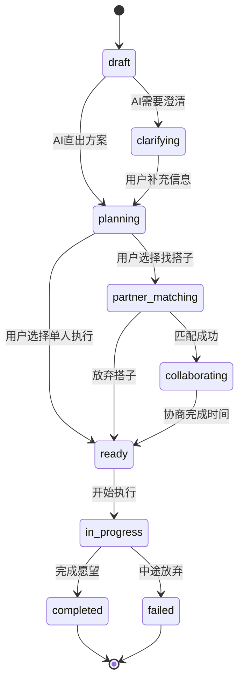

# Wishpool V3.0 产品需求文档（总领）

> **版本**：V3.0
> **最后更新**：2026-03-29
> **状态**：当前需求基准
> **替代**：PRD-wishpool-buddy-v1.md、PRD-wishpool-v2.md、PRD-v2.1-feed.md

---

## 产品定位

**许愿池 Wishpool** — 面向城市白领的周末解决方案系统。用户发出心愿，AI 直出可执行方案，系统推进与校验，可选搭子协同，确保心愿落地。

**核心价值**：将"想要但总是搁置"转化为"本周末就能开始的具体行动"。

**服务对象**：城市白领，有心愿/目标想要实现，通常在夜晚独处时打开 App，需要的不是效率工具，而是一个有仪式感的"许愿空间"。

**产品形态**：3-Tab 结构的匿名心愿社区 + AI 推进系统 + 会员订阅制（10元/月）

---

## 核心格局

```
┌─────────────────────────────────────────────┐
│  心愿广场 Tab    中间发愿按钮    我的心愿 Tab  │
│  ├─内容流浏览    ├─语音发愿      ├─愿望列表    │
│  ├─帮Ta实现      ├─AI出方案      ├─状态管理    │
│  ├─点赞评论      ├─轮次推进      ├─进度跟踪    │
│  └─漂流瓶        ├─搭子匹配      ├─历史归档    │
│                  ├─协同筹备      └─主题切换⚙️  │
│                  └─履约反馈                   │
├─────────────────────────────────────────────┤
│  个人设置        消息推送        主题体系      │
│  ├─会员体系      ├─轮次提醒      ├─眠眠月🌙    │
│  └─匿名隐私      ├─搭子通知      ├─朵朵云☁️    │
│                  └─社区互动      └─芽芽星🌱    │
└─────────────────────────────────────────────┘
```

---

## 板块索引

| 板块 | PRD 文件 | 当前版本 | 状态 | 用户故事 |
|------|---------|---------|------|---------|
| 心愿广场 | [PRD-plaza.md](PRD-plaza.md) | V1 | 部分实现 | US-01~04 |
| 心愿发布与深夜交流 | [PRD-wish-publish.md](PRD-wish-publish.md) | V1 | 部分实现 | US-05~10 |
| 个人心愿管理 | [PRD-wish-management.md](PRD-wish-management.md) | V1 | 仅 UI | US-11~13 |
| 个人设置 | [PRD-profile-settings.md](PRD-profile-settings.md) | V1 | 未实现 | US-14~15 |
| 消息推送 | [PRD-notifications.md](PRD-notifications.md) | V1 | 未实现 | US-16~19 |
| 主题切换与角色陪伴 | [PRD-theme-switching.md](PRD-theme-switching.md) | V1 | 实现中 | US-20~22 |

---

## 状态模型

**愿望状态流转**（跨板块共享）：

```
draft → clarifying → planning → partner_matching →
collaborating → ready → in_progress → completed/failed
```

| 状态 | 说明 | 用户可见标签 | 触发板块 |
|------|------|-------------|---------|
| `draft` | 刚发愿，等待 AI 出方案 | "AI 思考中" | 发布 |
| `clarifying` | AI 需要用户补充信息 | "需要澄清" | 发布 |
| `planning` | AI 生成方案，等待用户确认 | "方案待确认" | 发布 |
| `partner_matching` | 用户选择搭子匹配 | "寻找搭子中" | 发布 |
| `collaborating` | 与搭子协商时间安排 | "协商中" | 发布 |
| `ready` | 一切就绪，等待执行 | "准备开始" | 管理 |
| `in_progress` | 正在执行 | "进行中" | 管理 |
| `completed` | 完成并反馈 | "已完成" | 管理 |
| `failed` | 中途放弃 | "已放弃" | 管理 |



---

## 分期规划

### MVP (Phase 1) — 核心发愿链路 + 3-Tab 骨架

**目标**：验证"发愿→AI方案→搭子匹配→协同筹备"的核心价值链路

**包含功能**：
- 发愿链路：US-05, US-06, US-07, US-08, US-09
- 我的心愿：US-11, US-12
- 心愿广场：US-01, US-02, US-03（简化版，3-4种内容类型）
- 基础设施：US-14, US-15
- 消息推送：US-16, US-17（基础推送）

### Phase 2 — 社区深化与履约闭环

**目标**：完善社区互动，闭环履约体系

**包含功能**：
- US-10 履约与完成反馈
- US-04 漂流瓶（特殊内容类型）
- US-18 社区互动通知
- 心愿广场扩展（剩余内容类型+高级互动）

### Phase 3 — 数据价值与长期留存

**包含功能**：
- US-13 历史归档与回顾
- US-19 系统消息管理
- 数据洞察与个人成长报告

---

## 业务指标

**核心指标**：
- 愿望完成率 > 60%
- 用户月活跃愿望数 > 2
- 搭子协同成功率 > 40%
- 付费转化率 > 15%
- 用户NPS > 50

**增长指标**：
- 月新增用户数
- 用户留存率（7日、30日）
- 心愿广场内容互动率
- 愿望分享传播系数

---

## 归档说明

以下 PRD 的内容已整合至 V3.0 体系，保留文件作为历史参考：

| 归档文件 | 原版本 | 说明 |
|---------|--------|------|
| PRD-wishpool-buddy-v1.md | V1.0 | 微信服务号+按次付费模型，已弃用 |
| PRD-wishpool-v2.md | V2.0 | 搭子协同完整版，核心故事已整合 |
| PRD-v2.1-feed.md | V2.1 | Feed 内容流定义，已整合至心愿广场板块 |
