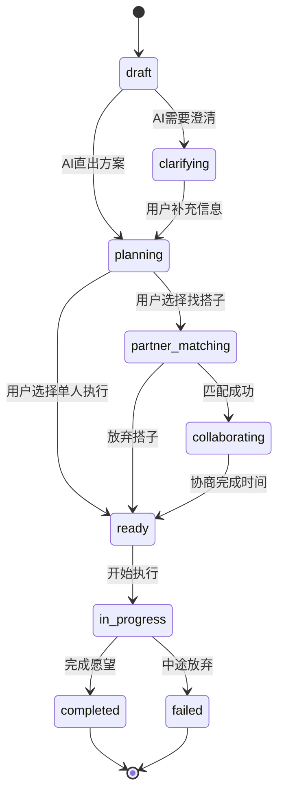

# PRD-wishpool-v3.0
# Wishpool V3.0 产品需求文档

> **版本**：V3.0
> **最后更新**：2026-03-28
> **状态**：当前需求基准
> **替代**：PRD-wishpool-buddy-v1.md、PRD-wishpool-v2.md、PRD-v2.1-feed.md

> **说明**：本 PRD 仅定义产品需求、分期与验收口径，不展开技术栈、工程结构或三端实现映射。

---

## 产品定位

**许愿池 Wishpool** — 面向城市白领的周末解决方案系统。用户发出心愿，AI 直出可执行方案，系统推进与校验，可选搭子协同，确保心愿落地。

**核心价值**：将"想要但总是搁置"转化为"本周末就能开始的具体行动"。

**产品形态**：3-Tab 结构的匿名心愿社区 + AI 推进系统 + 会员订阅制（10元/月）

---

## 整体架构

```
┌─────────────────────────────────────────────┐
│  心愿广场 Tab    中间发愿按钮    我的心愿 Tab  │
│  ├─内容流浏览    ├─语音发愿      ├─愿望列表    │
│  ├─帮Ta实现      ├─AI出方案      ├─状态管理    │
│  ├─点赞评论      ├─轮次推进      ├─进度跟踪    │
│  └─漂流瓶        ├─搭子匹配      └─历史归档    │
│                  ├─协同筹备                   │
│                  └─履约反馈                   │
└─────────────────────────────────────────────┘
```

---

## 状态模型

**愿望状态流转**：
```
draft → clarifying → planning → partner_matching →
collaborating → ready → in_progress → completed/failed
```

| 状态 | 说明 | 用户可见标签 |
|------|------|-------------|
| `draft` | 刚发愿，等待 AI 出方案 | "AI 思考中" |
| `clarifying` | AI 需要用户补充信息 | "需要澄清" |
| `planning` | AI 生成方案，等待用户确认 | "方案待确认" |
| `partner_matching` | 用户选择搭子匹配 | "寻找搭子中" |
| `collaborating` | 与搭子协商时间安排 | "协商中" |
| `ready` | 一切就绪，等待执行 | "准备开始" |
| `in_progress` | 正在执行 | "进行中" |
| `completed` | 完成并反馈 | "已完成" |
| `failed` | 中途放弃 | "已放弃" |

---

## 分期规划

### MVP (Phase 1) — 核心发愿链路 + 3-Tab 骨架

**目标**：验证"发愿→AI方案→搭子匹配→协同筹备"的核心价值链路

**包含功能**：
- 发愿链路：US-05, US-06, US-07, US-08, US-09
- 我的心愿：US-11, US-12
- 心愿广场：US-01, US-02, US-03（简化版，3-4种内容类型）
- 基础设施：US-14, US-15

### Phase 2 — 社区深化与履约闭环

**目标**：完善社区互动，闭环履约体系

**包含功能**：
- US-10 履约与完成反馈
- US-04 漂流瓶（特殊内容类型）
- 心愿广场扩展（剩余内容类型+高级互动）

### Phase 3 — 数据价值与长期留存

**包含功能**：
- US-13 历史归档与回顾
- 数据洞察与个人成长报告

---

## 用户故事

### 模块一：心愿广场（Feed Tab）

#### US-01｜内容流浏览

**作为** 许愿池用户
**我想要** 在心愿广场看到丰富的内容流
**以便于** 获得启发，了解他人的心愿与方案

**场景描述**：
用户打开 App 默认进入心愿广场，看到一个纵向滚动的内容流，包含以下类型：

1. **方案分享**：其他用户的 AI 生成方案（脱敏处理）
2. **进展更新**：正在执行愿望的用户分享进度照片/文字
3. **完成庆祝**：用户完成愿望后的成果展示
4. **求助呼吁**：用户发布需要帮助的具体任务
5. **灵感种草**：系统推荐的热门愿望类别
6. **搭子招募**：用户主动发布的搭子寻找信息
7. **漂流瓶**：匿名的心愿碎片（详见 US-04）

**交互流程**：
1. 用户打开心愿广场 Tab
2. 系统加载最新内容流（首屏10条）
3. 用户下拉刷新或上拉加载更多
4. 点击内容卡片进入详情页

**验收标准**：
- [ ] 支持 7 种内容类型的展示（MVP 阶段先支持前4种）
- [ ] 下拉刷新，上拉加载更多
- [ ] 内容卡片设计统一，显示用户头像（匿名）、发布时间、核心信息
- [ ] 点击卡片进入对应详情页
- [ ] 空状态友好提示

---

#### US-02｜帮Ta实现

**作为** 许愿池用户
**我想要** 参与帮助他人实现心愿的线上任务
**以便于** 获得助人的成就感，同时赚取平台积分/认可

**场景描述**：
用户在心愿广场看到"求助呼吁"类型的内容，这些是其他用户愿望中的可拆分线上任务，如：
- "帮我投票选择周末徒步路线（3个选项）"
- "帮我筛选Java培训机构（给5个机构打分）"
- "帮我起个宠物名字（从我的7个备选中选择）"

**交互流程**：
1. 用户在 Feed 中看到"求助呼吁"卡片，显示任务类型和预计用时
2. 点击"帮Ta一下"按钮
3. 进入任务页面，看到具体任务描述和操作界面
4. 完成任务（投票/打分/选择/输入建议）
5. 提交后看到感谢消息和积分奖励

**验收标准**：
- [ ] Feed 中"求助呼吁"卡片有明显的"帮Ta一下"按钮
- [ ] 任务页面显示清晰的任务描述和预计用时
- [ ] 支持常见任务类型：选择题、打分、排序、文字建议
- [ ] 完成任务后显示积分奖励和感谢消息
- [ ] 同一任务用户只能参与一次

---

#### US-03｜互动（点赞/评论）

**作为** 许愿池用户
**我想要** 对心愿广场的内容点赞和评论
**以便于** 表达认同，提供建议，增强社区氛围

**交互流程**：
1. 用户在 Feed 内容卡片底部看到点赞、评论、分享按钮
2. 点击点赞：红心动画，计数+1
3. 点击评论：进入评论区，可查看他人评论并发布自己的评论
4. 评论支持文字输入，140字以内

**验收标准**：
- [ ] 每个内容卡片底部有点赞、评论、分享按钮
- [ ] 点赞有动画反馈，显示当前点赞数
- [ ] 评论区显示历史评论，支持发布新评论
- [ ] 评论字数限制140字，实时显示剩余字数
- [ ] 评论发布后立即在列表中显示

---

#### US-04｜漂流瓶

**作为** 许愿池用户
**我想要** 看到和发布漂流瓶形式的匿名心愿碎片
**以便于** 获得温暖的陌生人连接，分享不便具名的心愿

**场景描述**：
漂流瓶是心愿广场中的特殊内容类型，完全匿名，内容短小精悍，传递情感和小心愿。区别于其他内容类型，漂流瓶不关联具体的执行计划，更多是情感表达。

**漂流瓶内容类型**：
1. **小心愿**："希望下个月能遇到一只温顺的流浪猫"
2. **感谢**："谢谢那个在地铁上让座的陌生人"
3. **鼓励**："正在学日语的朋友，加油呀！"
4. **分享**："今天在咖啡店听到很好听的歌"
5. **求运气**："明天面试，希望遇到nice的面试官"

**交互流程**：
1. 用户在心愿广场看到瓶子图标的特殊卡片
2. 点击查看瓶子内容，有打开瓶盖的动画
3. 可以给漂流瓶点赞或回复短消息
4. 用户可通过特殊入口发布自己的漂流瓶

**验收标准**：
- [ ] 漂流瓶在 Feed 中有独特的视觉样式（瓶子图标）
- [ ] 点击漂流瓶有开启动画
- [ ] 漂流瓶内容限制50字以内
- [ ] 支持对漂流瓶点赞和简短回复（20字以内）
- [ ] 用户可发布自己的漂流瓶，完全匿名

---

### 模块二：发愿（中间按钮 → 全链路）

#### US-05｜语音发愿 + 实时转写

**作为** 许愿池用户
**我想要** 通过语音快速表达我的心愿
**以便于** 自然、完整地描述我想做的事情

**交互流程**：
1. 用户点击底部中央的"+"按钮
2. 弹出录音面板，显示话筒动画
3. 用户按住录音，实时显示语音转写文字
4. 松开录音，确认转写内容无误后提交
5. 进入 AI 方案生成流程

**验收标准**：
- [ ] 中央按钮点击弹出录音面板
- [ ] 支持长按录音，最长60秒
- [ ] 实时语音转写，文字同步显示
- [ ] 可重新录音或手动编辑转写文字
- [ ] 提交后进入愿望处理流程

---

#### US-06｜AI 直出方案 + 用户确认关键细节

**作为** 许愿池用户
**我想要** AI 为我的心愿生成具体可执行的方案
**以便于** 不用自己费力规划，直接开始行动

**场景描述**：
用户提交心愿后，AI 分析愿望内容，生成结构化的执行方案，包括：
- 目标拆解
- 时间安排（优先安排在周末）
- 资源需求
- 执行步骤
- 风险预案

**交互流程**：
1. 用户提交心愿后，显示"AI 思考中"状态
2. AI 生成方案，展示给用户确认
3. 用户可以对方案的关键细节提出调整要求
4. AI 基于反馈优化方案
5. 用户确认最终方案，进入下一步

**验收标准**：
- [ ] AI 生成方案包含目标、时间、步骤、资源
- [ ] 方案展示清晰，结构化呈现
- [ ] 用户可针对具体环节提出调整意见
- [ ] AI 能基于反馈调整方案
- [ ] 确认方案后状态更新为"planning"

---

#### US-07｜48h 轮次推进与校验

**作为** 许愿池用户
**我想要** 系统定期推进我的愿望进展
**以便于** 保持执行节奏，不让计划搁置

**场景描述**：
方案确认后，系统每48小时主动询问用户进展，提供针对性建议，帮助用户保持执行节奏。如果用户多次无响应，系统会降低推进频率或建议调整计划。

**交互流程**：
1. 方案确认后，系统设置48小时后的第一次轮次
2. 时间到达时，向用户发送推进消息
3. 用户更新进展：顺利进行/遇到困难/需要调整计划
4. 系统基于反馈给出下一步建议
5. 设置下一个48小时轮次

**验收标准**：
- [ ] 系统自动在48小时后发送推进消息
- [ ] 用户可快速选择进展状态
- [ ] 系统基于状态提供个性化建议
- [ ] 连续无响应会调整推进频率
- [ ] 记录轮次历史，用户可查看

---

#### US-08｜搭子匹配

**作为** 许愿池用户
**我想要** 系统为我匹配合适的搭子一起完成心愿
**以便于** 增加执行动力，享受协同完成的乐趣

**场景描述**：
系统基于愿望类型、用户画像、时间偏好等因素，自动为用户匹配可能的搭子。用户可以选择接受匹配、进行深度调研、或放弃搭子独自执行。

**匹配逻辑**：
- 愿望类型相似或互补
- 地理位置接近（如涉及线下活动）
- 时间安排匹配
- 用户活跃度和信誉度

**交互流程**：
1. 用户在轮次推进中选择"寻找搭子"
2. 系统展示1-3个匹配候选人（脱敏信息）
3. 用户选择：
   - **接受搭子**：直接进入协同筹备
   - **深度调研**：查看更多信息，可在调研后拒绝
   - **放弃找搭子**：转为单人执行
4. 如选择深度调研，可看到搭子的历史完成记录、评价等
5. 深度调研后可选择：
   - **接受协同**
   - **拒绝搭子**：回到匹配池或转单人执行

**验收标准**：
- [ ] 系统能基于愿望内容匹配相关用户
- [ ] 显示搭子基本信息（匿名，但有标签）
- [ ] 提供接受/深度调研/放弃三个选择
- [ ] 深度调研显示搭子历史记录和评价
- [ ] 匹配成功后通知双方

---

#### US-09｜协同筹备

**作为** 许愿池用户
**我想要** 与搭子协商确定执行时间
**以便于** 确保双方都能参与，避免时间冲突

**场景描述**：
搭子匹配成功后，双方需要协商具体的执行时间安排。系统提供简单的协商工具，帮助双方快速达成一致。

**交互流程**：
1. 搭子匹配成功后，系统创建协商空间
2. 双方可看到彼此的大概可用时间
3. 发起方提出具体时间建议
4. 搭子回应：接受/提出其他时间/需要协商
5. 最多3轮协商，达成一致后确定执行计划
6. 系统记录最终安排，设置提醒

**验收标准**：
- [ ] 提供简单的时间协商界面
- [ ] 双方可提出和响应时间建议
- [ ] 协商限制在3轮内，避免无限拖延
- [ ] 达成一致后自动设置日历提醒
- [ ] 任何一方可以在执行前取消（需要理由）

---

#### US-10｜履约与完成反馈

**作为** 许愿池用户
**我想要** 完成愿望后记录成果并获得反馈
**以便于** 获得成就感，为其他用户提供经验

**交互流程**：
1. 愿望执行时间到达，系统发送履约提醒
2. 用户可标记：已完成/正在进行/遇到困难/取消执行
3. 如选择"已完成"，引导用户上传成果（照片/文字）
4. 系统询问愿望完成度、满意度、是否推荐给他人
5. 可选分享完成经验到心愿广场

**验收标准**：
- [ ] 执行时间自动提醒
- [ ] 提供多种完成状态选择
- [ ] 支持上传成果展示（图文）
- [ ] 收集满意度和推荐度反馈
- [ ] 可选分享经验到社区

---

### 模块三：我的心愿（右 Tab）

#### US-11｜愿望列表与状态管理

**作为** 许愿池用户
**我想要** 查看我所有愿望的状态和进展
**以便于** 了解当前需要处理的事项，管理我的心愿

**场景描述**：
"我的心愿" Tab 展示用户的所有愿望，按状态分组显示，用户可以快速了解哪些需要决策、哪些正在进行、哪些已经完成。

**列表分组**：
- **待决策**：需要用户确认方案、选择搭子等
- **进行中**：正在执行的愿望
- **已完成**：完成或放弃的愿望

**交互流程**：
1. 用户点击"我的心愿" Tab
2. 看到按状态分组的愿望列表
3. 每个愿望卡片显示基本信息和状态
4. 点击卡片进入详情页

**验收标准**：
- [ ] 按状态分组显示愿望列表
- [ ] 每个分组显示愿望数量
- [ ] 卡片显示愿望标题、状态、最近更新时间
- [ ] 支持下拉刷新获取最新状态
- [ ] 空状态有友好的引导文案

---

#### US-12｜愿望详情与进度跟踪

**作为** 许愿池用户
**我想要** 查看单个愿望的详细信息和执行进度
**以便于** 了解完整情况，做出下一步决策

**详情页内容**：
- 原始愿望描述
- AI 生成的方案
- 轮次推进记录
- 搭子信息（如有）
- 执行计划和时间安排
- 当前状态和下一步行动

**交互功能**：
- 查看方案详情
- 更新进展状态
- 与搭子沟通
- 调整计划
- 取消或完成愿望

**验收标准**：
- [ ] 展示完整的愿望信息和历史
- [ ] 提供状态更新操作
- [ ] 显示清晰的时间轴
- [ ] 如有搭子，显示协同信息
- [ ] 提供取消、调整、完成等操作

---

#### US-13｜历史归档与回顾

**作为** 许愿池用户
**我想要** 回顾我过去完成的愿望
**以便于** 获得成就感，总结经验，规划未来

**功能特性**：
- 完成愿望的成果展示
- 执行时间统计
- 协同搭子历史
- 个人成长记录
- 愿望类型分析

**验收标准**：
- [ ] 提供历史愿望的检索和筛选
- [ ] 展示个人完成统计数据
- [ ] 支持回顾和分享历史成果
- [ ] 生成个人成长报告（月度/年度）

---

### 模块四：基础设施

#### US-14｜会员体系

**作为** 许愿池用户
**我想要** 通过合理的付费获得优质服务
**以便于** 享受更好的AI建议和社区体验

**定价策略**：
- 会员费用：10元/月
- 非会员限制：每月只能发布3个愿望
- 会员权益：无限愿望、优先匹配、高级AI方案、专属客服

**验收标准**：
- [ ] 支持月度订阅支付
- [ ] 清晰展示会员权益
- [ ] 非会员有使用限制提示
- [ ] 提供会员续费和取消功能

---

#### US-15｜匿名身份与隐私

**作为** 许愿池用户
**我想要** 在匿名环境下使用服务
**以便于** 自由表达真实愿望，保护个人隐私

**匿名机制**：
- 用户用随机生成的昵称和头像
- 愿望内容脱敏处理后可能出现在广场
- 地理位置仅用于搭子匹配，不公开
- 聊天记录端对端加密

**验收标准**：
- [ ] 注册无需实名信息
- [ ] 系统生成匿名身份
- [ ] 个人信息严格保护
- [ ] 用户可控制信息公开程度

---

## 业务指标

**核心指标**：
- 愿望完成率 > 60%
- 用户月活跃愿望数 > 2
- 搭子协同成功率 > 40%
- 付费转化率 > 15%
- 用户NPS > 50

**增长指标**：
- 月新增用户数
- 用户留存率（7日、30日）
- 心愿广场内容互动率
- 愿望分享传播系数

---

## 验收总览

| 模块 | 用户故事 | 优先级 | Phase |
|------|---------|--------|-------|
| 心愿广场 | US-01 内容流浏览 | P0 | MVP |
| 心愿广场 | US-02 帮Ta实现 | P0 | MVP |
| 心愿广场 | US-03 互动 | P0 | MVP |
| 心愿广场 | US-04 漂流瓶 | P1 | Phase 2 |
| 发愿链路 | US-05 语音发愿 | P0 | MVP |
| 发愿链路 | US-06 AI方案 | P0 | MVP |
| 发愿链路 | US-07 轮次推进 | P0 | MVP |
| 发愿链路 | US-08 搭子匹配 | P0 | MVP |
| 发愿链路 | US-09 协同筹备 | P0 | MVP |
| 发愿链路 | US-10 履约反馈 | P1 | Phase 2 |
| 我的心愿 | US-11 状态管理 | P0 | MVP |
| 我的心愿 | US-12 进度跟踪 | P0 | MVP |
| 我的心愿 | US-13 历史归档 | P2 | Phase 3 |
| 基础设施 | US-14 会员体系 | P0 | MVP |
| 基础设施 | US-15 匿名隐私 | P0 | MVP |

---

## 附录：状态机图


