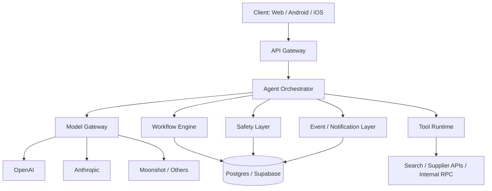
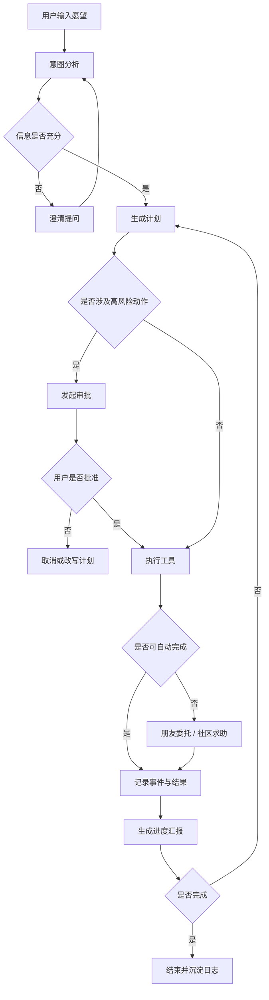

# 2026 年 AI Server SOTA 技术调研与 Wishpool 架构建议

## 调研目标

围绕 Wishpool 当前的 AI Server / Agent 服务设计，回答 4 个问题：

1. 当前行业里更接近 SOTA 的 AI Server，核心能力到底是什么
2. Wishpool 现有实现与这些能力相比，差距在哪里
3. 如果现在重新设计，Wishpool 的推荐目标架构应该是什么
4. 如何分阶段落地，避免一开始就把系统做得过重

本调研聚焦技术实现，不展开产品交互细节。

---

## 一句话结论

2026 年更接近 SOTA 的 AI Server，已经不再只是“把多个模型包一层 HTTP 接口”，而是一个具备以下能力的 **Agent Runtime + Model Gateway + Workflow Engine** 组合：

- 有模型路由，但不止于模型路由
- 有工具调用，但不是单轮 tool call，而是完整执行闭环
- 有长任务后台执行、断点恢复、人工审批、人机协同
- 有结构化输出约束、安全护栏、可观测性和评测闭环
- 能把“理解、规划、执行、委托、汇报”拆成可追踪、可恢复、可审计的状态机

对 Wishpool 来说，推荐目标不是继续强化一个“轻量本地 LLM 代理”，而是建设一个 **以状态机为中心的 Agent Server**：

- **Model Gateway** 负责模型选择、超时、重试、缓存、成本控制
- **Agent Runtime** 负责工具编排、结构化输出、上下文管理
- **Workflow Layer** 负责持久化任务、人工确认、恢复执行、通知汇报
- **Safety & Observability Layer** 负责权限、审计、trace、eval、风险控制

如果只从当前阶段的投入产出比考虑，Wishpool 最优路径不是“一步到位上最复杂的框架”，而是：

1. 先做生产级 `gateway + structured tool loop + 状态持久化`
2. 再补 `human-in-the-loop + long-running execution`
3. 最后再做 `自动优化飞轮（eval / prompt optimization / fine-tuning）`

---

## 什么叫 2026 年更接近 SOTA 的 AI Server

### 1. 不再只是 Chat Completion Proxy

早期 AI Server 常见形态是：

- 接收请求
- 转发给某个模型
- 返回文本或一个结构化 JSON

这种形态适合 demo，但不适合需要真实执行、异步任务、审批和追踪的产品。

更接近 SOTA 的系统，会把模型调用视为整个运行时中的一个节点，而不是系统本身。

### 2. 核心是 Agent Runtime

SOTA 方案的核心，不是“接了多少模型”，而是是否具备这些运行时能力：

- **工具调用闭环**：模型提出工具调用后，服务端真正执行工具，并把结果再喂回模型，直到得到可交付结果
- **状态持久化**：每次推理、工具调用、审批、失败、恢复，都有可持久化状态
- **长任务后台执行**：复杂任务不依赖单个 HTTP 长连接存活
- **人工中断与恢复**：在付款、隐私、发布、委托等关键节点停下来等人确认
- **可观测与可调试**：知道每一步卡在哪、哪个模型贵、哪个工具常失败、哪类 prompt 表现差

### 3. 安全边界前置，而不是事后补

对于 Wishpool 这类会碰到“代预约、代下单、代查询、代委托”的系统，SOTA 标准里安全不是附属项，而是主流程的一部分：

- 请求鉴权
- 工具白名单
- 分级审批
- 金额阈值
- PII 脱敏
- Prompt injection 隔离
- 审计日志

### 4. 模型能力和工作流能力同时升级

前沿模型当然重要，但 2026 年真正拉开差距的，通常不是“换更强模型”本身，而是：

- 更合理的模型分工
- 更稳的 structured outputs
- 更好的 prompt caching / context compaction
- 更可靠的 workflow orchestration
- 更快的 eval -> prompt -> deploy 闭环

---

## 官方能力信号与行业趋势

以下信号说明，主流平台已经把“长任务、工具、结构化输出、可观测”当成 agent 系统的基础能力，而不是附加功能。

### OpenAI 侧

- `GPT-5.2` 官方定位已经明确偏向复杂 agentic tasks，而不只是通用对话模型
- Responses API 支持 **background mode**，允许把长任务异步放到后台执行，并通过轮询或流式恢复进度
- Function calling 支持 **strict mode**，官方建议默认启用严格 schema 约束
- Prompt caching 已成为默认优化手段，强调把稳定前缀放在前部以降低成本和延迟
- Agents SDK 已把 tracing 作为内建能力，默认追踪 generation、tool calls、guardrails、handoffs

### Anthropic 侧

- Claude 的工具调用文档强调的已经不是“会不会调用工具”，而是如何构建完整 tool loop
- 官方明确建议复杂工具任务优先用更强模型，并强调工具描述质量是关键
- Prompt caching 支持更长生命周期与更细粒度缓存策略
- Computer use 提供了浏览器 / 桌面级自动执行能力，但官方同时明确要求高风险操作必须有人确认

### LangGraph / LangChain Runtime 侧

- LangChain 官方明确表示：agent 构建在 LangGraph 之上，是为了拿到 durable execution、streaming、human-in-the-loop、persistence
- LangGraph 的 `interrupt()` 机制把人工审批变成一等公民能力

这三个方向合在一起，已经足以说明一条很清晰的 SOTA 路线：

> 模型负责推理，Runtime 负责编排，Workflow 负责持久化，Safety 负责约束，Observability 负责持续优化。

---

## Wishpool 当前现状判断

结合当前仓库实现，Wishpool 已经有一些正确方向，但整体还处于“Agent MVP 的前半段”。

### 已有正确基础

1. 已有 role-based model routing 思路
2. 已有结构化 tool schema 思路
3. 已有 Supabase 持久化表设计
4. 已有执行日志、工具调用日志、委托记录的数据库草图

### 主要短板

1. **本地 AI Server 仍是单轮接口形态**
   - 更像 `analyze` / `plan` API
   - 还不是可恢复的 Agent Runtime

2. **执行链路没有真正落地**
   - “execute” 仍停留在占位层
   - 没有真实工具编排、审批、回写和失败补偿

3. **缺少后台运行模型**
   - 当前实现更偏同步 HTTP
   - 不适合长任务和中断恢复

4. **缺少生产安全底座**
   - 鉴权、限流、审批、Secrets 管理、工具权限分级都还不完整

5. **缺少 observability / eval flywheel**
   - 目前更像功能实现
   - 还不是可持续优化系统

---

## Wishpool 推荐目标架构

推荐使用“分层明确、状态机驱动”的服务架构。

---

## 分层设计建议

### 一层：API Gateway

职责：

- 统一接入 Web / Android / iOS
- 做鉴权、限流、请求幂等键、租户隔离
- 提供同步接口和异步任务接口

推荐接口形态：

- `POST /agent/runs`
- `GET /agent/runs/:id`
- `POST /agent/runs/:id/approve`
- `POST /agent/runs/:id/cancel`
- `GET /agent/runs/:id/events`

设计原则：

- 面向“运行实例 run”而不是面向“单次 LLM 调用”
- 所有跨端状态都围绕 `run_id` 聚合

### 二层：Agent Orchestrator

职责：

- 接收用户目标
- 驱动“理解 -> 规划 -> 执行 -> 委托 -> 汇报”的主流程
- 管理节点间状态迁移

推荐不要把它写成一个巨大函数，而是拆成显式节点：

- `intent_analyzer`
- `clarification_gate`
- `planner`
- `execution_router`
- `tool_executor`
- `delegation_handler`
- `reporter`
- `completion_handler`

这层是系统大脑，但不直接做网络请求细节，也不直接存数据库细节。

### 三层：Model Gateway

职责：

- 模型选择
- Provider 适配
- 超时控制
- Retry / fallback / circuit breaker
- Prompt caching 策略
- 成本与延迟统计

推荐能力：

- **按任务角色分模型**
  - 分类/抽取：便宜快模型
  - 规划/复杂决策：强模型
  - 工具执行后的总结/汇报：中档模型
- **统一响应对象**
  - `raw_response`
  - `structured_output`
  - `tool_calls`
  - `usage`
  - `latency_ms`
  - `provider`
  - `model`

不要把“业务状态”放在 gateway 层。

### 四层：Workflow Engine

职责：

- 持久化 run 状态
- 支持暂停、恢复、重试
- 处理人工审批
- 记录每一步节点结果

如果要贴近当前仓库现实，有两种实现路线：

#### 路线 A：轻量自建状态机

基于 Supabase/Postgres 表实现：

- `agent_runs`
- `agent_steps`
- `agent_tool_calls`
- `agent_approvals`
- `agent_delegations`
- `agent_events`

优点：

- 与当前仓库最贴合
- 认知成本低
- 迁移成本低

缺点：

- 后续复杂补偿、并发控制、恢复逻辑要自己维护

#### 路线 B：引入 Workflow Runtime

可选：

- LangGraph
- Temporal
- Inngest / Trigger.dev 这类事件工作流

对 Wishpool 的推荐是：

- **当前阶段先用路线 A**
- **当自动执行和人工审批开始变复杂时，升级到 LangGraph 或 Temporal**

原因很简单：Wishpool 现在的难点不是框架不够强，而是先把正确抽象跑通。

### 五层：Tool Runtime

职责：

- 执行真实工具
- 管理工具权限
- 标准化工具结果
- 支持幂等重试

工具定义建议：

- 每个工具都包含：
  - `name`
  - `description`
  - `input_schema`
  - `risk_level`
  - `requires_approval`
  - `idempotency_strategy`
  - `timeout_ms`
  - `retry_policy`

Wishpool 的工具应按风险分级：

- `L0` 只读工具
  - 搜索、比价、查询、信息抓取
- `L1` 可逆写工具
  - 草稿保存、候选列表生成、提醒创建
- `L2` 高风险工具
  - 下单、预约、发消息、发社区帖子、委托亲友

`L2` 工具默认不允许模型直接执行，必须走审批节点。

### 六层：Safety Layer

职责：

- PII 检测与脱敏
- Prompt injection 隔离
- 输出结构约束
- 工具白名单与动作审批
- 预算 / 额度 / 敏感操作门控

Wishpool 推荐最少做到：

1. **结构化输出默认开启**
2. **高风险工具强制审批**
3. **社区发帖默认先脱敏再确认**
4. **支付 / 下单 / 预约默认双确认**
5. **外部网页与用户输入分隔注入**

### 七层：Observability & Eval

职责：

- Trace 每次运行
- 记录 token / latency / success rate / tool error rate
- 采集人工纠正数据
- 驱动 prompt 优化和模型策略调整

推荐最少埋点：

- `run_created`
- `intent_classified`
- `plan_generated`
- `approval_requested`
- `approval_granted`
- `tool_called`
- `tool_failed`
- `fallback_triggered`
- `delegation_published`
- `run_completed`
- `run_failed`

评测集建议分 4 类：

- 意图分类准确率
- 方案质量完整率
- 工具调用成功率
- 安全违规率

---

## 推荐工作流设计

下面这条流程更适合 Wishpool 的产品本质。

这个流程的重点不是“多智能”，而是：

- 状态可追踪
- 关键节点可暂停
- 任意节点可恢复
- 最终结果可审计

---

## 推荐技术选型

### 方案总览

#### 方案 A：最贴合现状的推荐方案

- **接入层**：Supabase Edge Functions 或 Node API 服务
- **数据库**：Supabase Postgres
- **工作流**：先用 Postgres 状态机
- **模型网关**：自建统一 gateway
- **模型主力**：
  - OpenAI `gpt-5.2` / `gpt-5-mini`
  - Anthropic Claude Sonnet 4
  - 保留 Moonshot 作为区域性补充
- **追踪与评测**：
  - 先落数据库审计 + 结构化事件
  - 再接 OpenAI tracing / OpenTelemetry

这是我最推荐的路线。

原因：

- 对当前仓库侵入最小
- 能迅速把“demo 级 agent”提升到“生产可控 agent”
- 不会过早把系统绑定在复杂框架上

#### 方案 B：更重但更前瞻的方案

- API 层：Node / TypeScript 服务
- Workflow：LangGraph
- Trace：OpenTelemetry + provider trace
- Queue：Redis / Postgres queue
- DB：Postgres

优点：

- 人工审批、恢复执行、流式事件天然更顺手
- 更适合长链路 agent 产品

缺点：

- 认知成本更高
- 初期集成复杂度更高

对 Wishpool 来说，这更像 **第二阶段升级目标**，不是第一步。

---

## 模型策略建议

### 不建议

- 所有角色统一绑一个最强模型
- 把 fallback 当成唯一可靠性手段
- 用文本输出“模拟结构化”

### 推荐

#### 角色分工

- **Intent / Extraction**
  - 便宜快模型
  - 强调 strict structured outputs

- **Planning / Delegation Decision**
  - 强模型
  - 强调 reasoning 与工具约束

- **Execution Summary / User-facing Report**
  - 中档模型
  - 强调表达稳定与成本

#### Provider 策略

- OpenAI 适合作为 agentic tasks 主力参考线
- Anthropic 适合复杂工具推理和多轮 tool loop
- Moonshot / DeepSeek 适合作为区域性补充与成本优化层

#### Prompt 策略

- 静态系统提示、工具定义、规则文档置前
- 用户特定上下文置后
- 用 prompt caching 设计稳定前缀
- 高风险节点始终输出结构化对象，不直接输出自由文本命令

---

## 数据模型建议

建议在现有 `wish_agent_states` 等表的基础上，重构为更清晰的 run-centric 模型。

### 建议新增或演进的核心表

#### `agent_runs`

记录一条用户愿望的完整运行实例。

核心字段：

- `id`
- `user_id`
- `device_id`
- `wish_text`
- `status`
- `current_node`
- `risk_level`
- `approval_status`
- `started_at`
- `completed_at`

#### `agent_run_steps`

记录每一个节点的执行结果。

核心字段：

- `run_id`
- `node_name`
- `input_payload`
- `output_payload`
- `status`
- `attempt`
- `started_at`
- `finished_at`

#### `agent_tool_invocations`

记录真实工具调用。

核心字段：

- `run_id`
- `step_id`
- `tool_name`
- `tool_input`
- `tool_output`
- `success`
- `latency_ms`
- `requires_approval`

#### `agent_approvals`

记录所有人工审批节点。

核心字段：

- `run_id`
- `approval_type`
- `approval_payload`
- `decision`
- `decided_by`
- `decided_at`

#### `agent_events`

统一事件流，供客户端轮询或 SSE 消费。

核心字段：

- `run_id`
- `event_type`
- `payload`
- `created_at`

#### `agent_eval_samples`

用于沉淀评测样本和用户纠正结果。

---

## API 设计建议

### 面向 run，而不是面向单次动作

#### 创建运行

`POST /agent/runs`

入参：

- `wish_text`
- `device_id`
- `context`
- `mode`

出参：

- `run_id`
- `status`
- `next_action`

#### 获取状态

`GET /agent/runs/:run_id`

返回：

- 当前状态
- 当前步骤
- 最近事件
- 是否等待审批

#### 审批动作

`POST /agent/runs/:run_id/approve`

#### 拒绝动作

`POST /agent/runs/:run_id/reject`

#### 订阅事件

`GET /agent/runs/:run_id/events`

支持：

- SSE
- 或客户端轮询

### 为什么这样设计

因为 Wishpool 的核心需求天然是异步和可中断的：

- “帮我订”
- “先查一下”
- “这个要不要发社区”
- “超过预算要不要继续”

这些都不适合只用一次请求一次响应建模。

---

## 可靠性设计建议

SOTA AI Server 不等于“不会失败”，而等于“失败了还能恢复、能解释、可控”。

### 必做项

1. **超时**
   - 模型调用超时
   - 工具调用超时

2. **重试**
   - 只读工具可自动重试
   - 写操作默认不盲重试，必须幂等

3. **幂等键**
   - 预约、下单、委托、发帖都要有幂等保障

4. **断点恢复**
   - run 能从 `approval_requested` 或 `tool_failed` 状态恢复

5. **Fallback**
   - 模型 fallback
   - 工具 fallback
   - 路径 fallback

6. **熔断**
   - 单个 provider 或工具持续异常时快速降级

---

## 安全设计建议

Wishpool 是离真实世界动作很近的产品，安全层必须比普通问答产品更严格。

### 最低建议

#### 1. Secrets 管理

- 所有密钥只允许保存在环境变量或专用 secret manager
- 仓库中禁止出现真实 key

#### 2. Tool Permission Boundary

- 模型只能“申请使用工具”
- 真正执行由服务端决定
- 高风险工具强制审批

#### 3. 数据脱敏

- 社区求助默认去掉手机号、精确地址、真实姓名
- 朋友委托虽可保留更多信息，也必须先展示给用户确认

#### 4. Prompt Injection 防护

- 外部网页和用户输入都视为不可信
- 不允许把外部内容直接拼进高权限系统提示
- 工具结果和策略规则分层隔离

#### 5. 审计

- 任何高风险动作必须可追踪“谁发起、谁批准、执行了什么”

---

## 可观测性与评测建议

如果没有可观测性，Agent 系统的迭代会非常痛苦。

### Trace 维度

- 哪个模型被调用
- 调用时长
- 输入输出 token
- 生成了哪些 tool call
- 哪些 tool call 成功 / 失败
- 哪一步触发了人工审批
- 哪一步被用户纠正

### 业务评测维度

#### 1. 意图理解

- 主分类准确率
- 约束提取完整率
- 偏好提取完整率

#### 2. 规划质量

- 步骤完整率
- 决策点合理率
- 时间 / 预算 / 风险要素覆盖率

#### 3. 执行能力

- 工具成功率
- 自动完成率
- 审批后成功完成率

#### 4. 安全质量

- 未授权高风险操作数
- PII 泄露数
- 错误委托数
- 违规内容发布率

### 数据闭环

应把这些信号沉淀回：

- prompt 调整
- tool 描述优化
- provider 路由优化
- 评测集扩充
- 后续 fine-tuning / preference optimization

---

## Wishpool 的分阶段落地建议

### Phase 1：从 Demo Agent 升级到生产可控 Agent

目标：

- 不追求“全自动”
- 先追求“可控、可追踪、可恢复”

建议事项：

1. 把当前 `/analyze` 和 `/plan` 升级为 run-based API
2. 建立统一 `Model Gateway`
3. 默认启用 structured outputs
4. 接入 run / step / tool / event 表
5. 增加审批节点能力
6. 增加基础 trace 和 usage 统计

这是当前最该做的阶段。

### Phase 2：补全真实执行闭环

目标：

- 从“给计划”走向“真正帮做”

建议事项：

1. 接入真实只读工具
   - 搜索
   - 比价
   - 商户信息查询

2. 再接入低风险写工具
   - 草稿创建
   - 收藏候选项
   - 生成委托草稿

3. 最后接高风险动作审批
   - 发布帖子
   - 预约
   - 下单

### Phase 3：加入人机协同和长任务后台执行

目标：

- 让 Agent 真正具备“陪伴执行”能力

建议事项：

1. 增加后台任务运行模型
2. 增加可恢复审批队列
3. 增加日报 / 晚间汇报策略
4. 增加用户主动追问进度能力

### Phase 4：建立优化飞轮

目标：

- 持续提升质量，而不是靠人工调 prompt

建议事项：

1. 建评测集
2. 建回归测试
3. 做 prompt optimizer / eval flywheel
4. 视数据规模考虑 fine-tuning

---

## 不建议现在做的事

为了避免系统过度设计，以下几件事不建议在当前阶段优先做：

### 1. 不建议先上全量多 Agent handoff 框架

原因：

- 当前问题还不是 agent 太少
- 而是单条运行链路还不够稳

### 2. 不建议一开始就把所有工具自动开放给模型

原因：

- 会把安全问题提前放大
- 也会让调试难度失控

### 3. 不建议先押宝“浏览器自动化万能执行”

原因：

- computer use 很强，但风险和维护成本也高
- 更适合做补充执行通道，不适合作为首要路径

### 4. 不建议把所有优化都寄托在换更强模型

原因：

- 对 Agent 产品来说，workflow 设计和 guardrail 设计通常比单纯换模型更重要

---

## 推荐结论

如果只给 Wishpool 一个明确建议，我会建议：

> 把 AI Server 从“本地 LLM 代理”升级为“状态机驱动的 Agent Runtime”，并优先补齐 `run-based API + structured tool loop + 审批节点 + 持久化事件流 + 基础 tracing` 这 5 个能力。

这条路线既符合当前行业更接近 SOTA 的方向，也能最大程度复用 Wishpool 已有的 Supabase 数据层和当前 role-based model routing 思路。

从投入产出比看，这是比“继续堆 prompt”或“盲目接更多模型”更值得优先做的事。

---

## 建议的下一步落地清单

### 立即执行

1. 设计 `agent_runs` 主模型和事件流接口
2. 把现有 AI Server 重构为 `Model Gateway`
3. 把现有 `analyze / plan` 改造成 workflow 节点
4. 接入审批节点与事件表
5. 清理 secrets 管理方式

### 两周内

1. 跑通完整的 `analyze -> plan -> approve -> execute(read-only) -> report`
2. 建第一版评测集
3. 建 trace / usage 面板

### 一个月内

1. 加入低风险写工具
2. 加入中断恢复
3. 加入 nightly report / progress query

---

## 参考资料

### OpenAI 官方

- [GPT-5.2 model page](https://platform.openai.com/docs/models/gpt-5.2)
- [Using GPT-5.2](https://platform.openai.com/docs/guides/latest-model)
- [Background mode](https://platform.openai.com/docs/guides/background)
- [Function calling with Structured Outputs](https://platform.openai.com/docs/guides/function-calling/function-calling-with-structured-outputs)
- [Prompt caching](https://platform.openai.com/docs/guides/prompt-caching)
- [Safety in building agents](https://platform.openai.com/docs/guides/agent-builder-safety)
- [OpenAI Agents SDK tracing](https://openai.github.io/openai-agents-python/tracing/)

### Anthropic 官方

- [How to implement tool use](https://docs.anthropic.com/en/docs/agents-and-tools/tool-use/implement-tool-use)
- [Computer use tool](https://docs.anthropic.com/en/docs/build-with-claude/computer-use)
- [Prompt caching](https://docs.anthropic.com/en/docs/build-with-claude/prompt-caching)
- [OpenAI SDK compatibility](https://docs.anthropic.com/en/api/openai-sdk)

### LangChain / LangGraph 官方

- [LangChain overview](https://docs.langchain.com/oss/javascript/langchain/overview)
- [LangGraph human-in-the-loop / interrupts](https://docs.langchain.com/oss/javascript/langgraph/human-in-the-loop)
- [LangGraph v1 release notes](https://docs.langchain.com/oss/javascript/releases/langgraph-v1)

